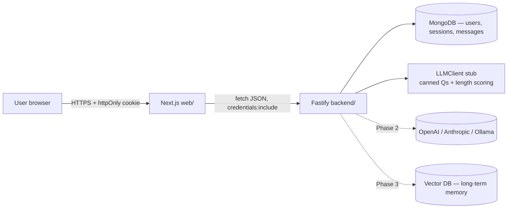
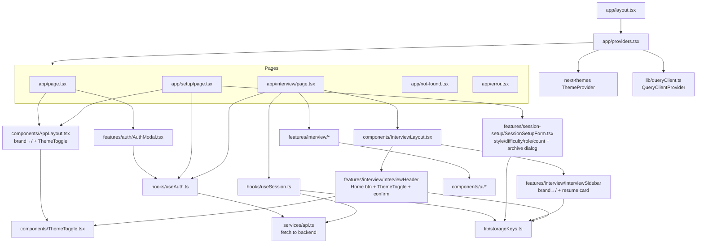
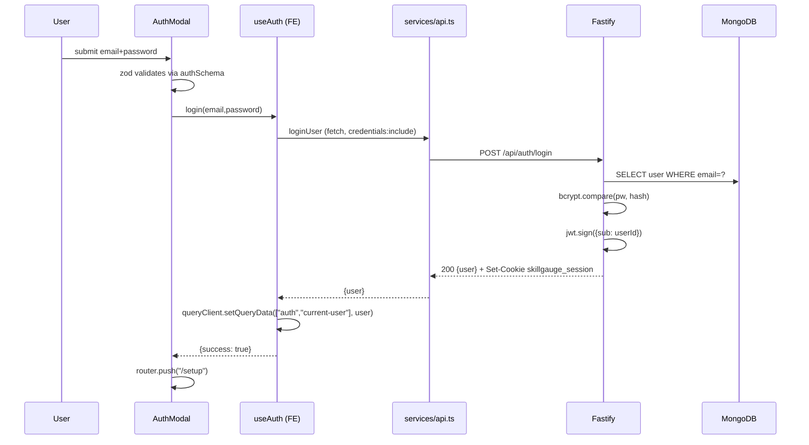

# SkillGauge — Architecture

Living architecture reference. **Update this file in the same commit as any structural change** (new module, new route, new service, phase transition).

**Current phase:** Phase 1.1 complete (UX enhancements: dark mode, rich setup inputs, resume-per-session guard). Next up: Phase 1.5 — Auth hardening (starts with JWT login polish), then Phase 2 sub-parted into 2a → 2e.
**Last updated:** 2026-04-20
**Scope of this doc:** Full stack — FE (Next.js) in [web/](web/) and BE (Fastify + MongoDB) in [backend/](backend/). The AI layer is a deterministic stub behind the `LLMClient` interface; swapping to a real provider is Phase 2.

---

## 1. Project overview

SkillGauge is an AI-powered interview preparation platform. A user uploads a resume, pastes a target job description, and practices interview questions in a chat-style UI while the system tracks progress over time.

**What exists today (end of Phase 1.1):**
- Next.js 16 App Router FE in [web/](web/) with light/dark themes via `next-themes`
- Fastify 5 + TypeScript BE in [backend/](backend/) with MongoDB persistence (`mongodb` driver)
- httpOnly cookie JWT auth (`@fastify/cookie` + `jsonwebtoken` + `bcryptjs`)
- `LLMClient` interface with `stubClient` — canned questions organized by interview style + difficulty, length-proxy grading scaled by difficulty
- Rich setup form — interview style, difficulty, role level, question count, optional focus areas — all persisted on the session doc and threaded through every LLM call
- Resume + active-session are surfaced in the interview sidebar; navigating away mid-session is guarded with a confirm dialog; swapping resume archives the previous snapshot locally
- Real HTTP between FE ↔ BE via `fetch` with `credentials: "include"`
- 23 Jest tests on FE + 13 Jest tests on BE = 36 total, green in CI
- Parallel CI jobs for `web/` and `backend/` in a single workflow

**What is planned:**
- Real LLM provider behind `LLMClient` interface (OpenAI / Anthropic / Ollama) — Phase 2
- Vector DB for long-term memory across sessions — Phase 3
- Progress dashboard + analytics — Phase 3
- E2E tests, observability, deploy, rate limits — Phase 4

---

## 2. Tech stack

### Frontend ([web/](web/))

| Concern | Tool | Version | Where |
|---|---|---|---|
| Framework | Next.js (App Router) | 16.2.4 | [web/](web/) |
| UI library | React + React DOM | 19.2.4 | [web/](web/) |
| Language | TypeScript | ^5 | [web/tsconfig.json](web/tsconfig.json) |
| Styling | Tailwind CSS | ^4 | [web/app/globals.css](web/app/globals.css) |
| Theming | next-themes (light/dark/system) | ^0.4.x | [web/app/providers.tsx](web/app/providers.tsx), [ThemeToggle.tsx](web/components/ThemeToggle.tsx) |
| UI primitives | Radix UI (dialog, slot) + shadcn pattern | various | [web/components/ui/](web/components/ui/) |
| Icons | lucide-react | ^1.8.0 | used across components |
| Server state | @tanstack/react-query | ^5.99.1 | [web/lib/queryClient.ts](web/lib/queryClient.ts) |
| Form state | react-hook-form | ^7.72.1 | `features/*/` |
| Validation | zod | ^4.3.6 | `features/*/Schema.ts` |
| Resolver | @hookform/resolvers | ^5.2.2 | feature forms |
| Testing | Jest + RTL + jest-dom + user-event | Jest 30 / RTL 16 | [web/jest.config.ts](web/jest.config.ts) |
| Test env | jest-environment-jsdom | 30 | [web/jest.setup.ts](web/jest.setup.ts) |
| Lint | ESLint + eslint-config-next | 9 / 16.2.4 | [web/eslint.config.mjs](web/eslint.config.mjs) |
| Build | Next.js + Turbopack | 16.2.4 | [web/next.config.ts](web/next.config.ts) |

### Backend ([backend/](backend/))

| Concern | Tool | Version | Where |
|---|---|---|---|
| HTTP server | Fastify | ^5.8.5 | [backend/src/app.ts](backend/src/app.ts) |
| Language | TypeScript (CommonJS output) | ^5.9.3 | [backend/tsconfig.json](backend/tsconfig.json) |
| DB driver | mongodb (official Node driver, async) | ^7.1.1 | [backend/src/db/connection.ts](backend/src/db/connection.ts) |
| Auth cookies | @fastify/cookie | ^11.0.2 | [backend/src/plugins/auth.ts](backend/src/plugins/auth.ts) |
| CORS | @fastify/cors | ^11.2.0 | [backend/src/app.ts](backend/src/app.ts) |
| JWT | jsonwebtoken | ^9.0.3 | [backend/src/plugins/auth.ts](backend/src/plugins/auth.ts) |
| Password hashing | bcryptjs (pure JS — Windows-safe) | ^3.0.3 | [backend/src/modules/auth/auth.service.ts](backend/src/modules/auth/auth.service.ts) |
| Validation | zod (shared with FE) | ^4.3.6 | [backend/src/modules/**/*.schema.ts](backend/src/modules/) |
| Env parsing | dotenv + zod | ^17.4.2 | [backend/src/config/env.ts](backend/src/config/env.ts) |
| Dev runner | tsx (watch mode) | ^4.21.0 | `npm run dev` |
| Testing | Jest + ts-jest (via `app.inject()`) | 30 / 29.4.9 | [backend/jest.config.ts](backend/jest.config.ts) |
| Test DB | mongodb-memory-server (per-suite mongod) | ^11.0.1 | [backend/tests/mongoHarness.ts](backend/tests/mongoHarness.ts) |

### Repo-wide

| Concern | Tool | Where |
|---|---|---|
| CI | GitHub Actions (parallel `web` + `backend` jobs) | [.github/workflows/ci.yml](.github/workflows/ci.yml) |

---

## 3. Folder structure

```
SkillGauge/
├── ARCHITECTURE.md              ← this file
├── PROGRESS.md                  ← living build log (phase checklists + changelog)
├── IMPLEMENTATION_STATUS.md     ← what is / isn't built, reconciled per phase
├── README.md                    ← top-level intro, run instructions
├── audits/
│   └── code-duplication-audit-2026-04-19.md
├── .github/
│   └── workflows/ci.yml         ← parallel web + backend jobs
├── backend/                     ← Fastify 5 HTTP API (Phase 1)
│   ├── src/
│   │   ├── config/env.ts        ← zod-validated env schema
│   │   ├── db/
│   │   │   ├── connection.ts    ← MongoClient singleton + getDb() + closeDb()
│   │   │   ├── indexes.ts       ← ensureIndexes() — unique email + partial unique question slots
│   │   │   └── repos/           ← data access (users / sessions / messages collections)
│   │   ├── llm/
│   │   │   ├── LLMClient.ts     ← provider-agnostic interface (context includes style/difficulty/roleLevel)
│   │   │   ├── stubClient.ts    ← behavioral / technical-by-difficulty / mixed banks + role-suffix + length-proxy scoring
│   │   │   └── index.ts         ← factory switch on LLM_PROVIDER
│   │   ├── plugins/
│   │   │   └── auth.ts          ← JWT sign/verify + cookie set + requireAuth hook
│   │   ├── modules/
│   │   │   ├── auth/            ← routes + service + zod schema
│   │   │   ├── sessions/        ← session init + questions + answers (protected)
│   │   │   └── health/          ← GET /api/health
│   │   ├── shared/types.ts      ← User / Session / Message / AuthResponse
│   │   ├── app.ts               ← buildApp() factory (separate from listen)
│   │   └── index.ts             ← main() bootstrap
│   ├── tests/
│   │   ├── auth.test.ts         ← 6 tests (register/login/me/logout/errors)
│   │   ├── sessions.test.ts     ← 5 tests (init + Q&A + ownership + errors)
│   │   ├── setup.ts             ← NODE_ENV=test, JWT_SECRET, LLM_PROVIDER=stub
│   │   └── mongoHarness.ts      ← per-suite mongodb-memory-server lifecycle
│   ├── .env.example
│   ├── jest.config.ts
│   ├── package.json             ← scripts: dev / build / start / test / typecheck / migrate
│   └── tsconfig.json            ← CommonJS + Node resolution + @/* paths
└── web/                         ← Next.js 16 App Router app
    ├── app/                     ← App Router pages + root layout
    │   ├── layout.tsx           ← root HTML + <Providers> (suppressHydrationWarning for next-themes)
    │   ├── providers.tsx        ← ThemeProvider + QueryClientProvider (client, lazy-init)
    │   ├── page.tsx             ← /         landing
    │   ├── setup/page.tsx       ← /setup    upload resume + JD + interview options
    │   ├── interview/page.tsx   ← /interview Q&A transcript
    │   ├── not-found.tsx        ← 404
    │   ├── error.tsx            ← runtime error boundary
    │   └── globals.css          ← Tailwind 4 @theme tokens + .dark palette + animation utils
    ├── components/
    │   ├── AppLayout.tsx        ← top-nav shell (brand→/, ThemeToggle)
    │   ├── InterviewLayout.tsx  ← sidebar/header/main shell
    │   ├── ThemeToggle.tsx      ← Sun/Moon toggle, mounted-gated
    │   └── ui/                  ← shadcn primitives
    ├── features/
    │   ├── auth/                ← AuthModal + authSchema
    │   ├── session-setup/       ← SessionSetupForm (resume + JD + style/difficulty/roleLevel/count/focusAreas)
    │   │                          + sessionSetupSchema (+ archive-confirm Dialog)
    │   └── interview/           ← MessageBubble, AnswerInput, InterviewHeader (home+theme), InterviewSidebar (resume card)
    ├── hooks/
    │   ├── useAuth.ts           ← /me query + login/register/logout mutations
    │   └── useSession.ts        ← init + answer mutations (single atomic append)
    ├── lib/
    │   ├── queryClient.ts       ← QueryClient factory
    │   ├── storageKeys.ts       ← STORAGE_KEYS (session: id, jobDescription, options, archived, active)
    │   └── utils.ts             ← cn() className merger
    ├── services/
    │   └── api.ts               ← real HTTP client (credentials: "include")
    ├── test/queryWrapper.tsx
    ├── .env.local.example       ← NEXT_PUBLIC_API_BASE_URL
    ├── jest.config.ts
    ├── jest.setup.ts
    ├── next.config.ts
    ├── tsconfig.json
    └── package.json
```

---

## 4. System context



Solid edges = implemented today. Dashed edges = planned.

---

## 5. Frontend module map



---

## 6. Backend module map

```mermaid
flowchart TB
  index[src/index.ts<br/>bootstrap] --> app[src/app.ts<br/>buildApp factory]
  app --> cors[@fastify/cors]
  app --> cookie[@fastify/cookie]
  app --> authPlugin[plugins/auth.ts<br/>JWT + cookie + requireAuth]
  app --> healthR[modules/health]
  app --> authR[modules/auth/auth.routes.ts]
  app --> sessR[modules/sessions/sessions.routes.ts]

  authR --> authS[auth.service.ts]
  authR --> authSchema[auth.schema.ts]
  sessR --> sessS[sessions.service.ts]
  sessR --> sessSchema[sessions.schema.ts]
  sessR -.preHandler.-> authPlugin

  authS --> userRepo[db/repos/users.ts]
  sessS --> sessRepo[db/repos/sessions.ts]
  sessS --> msgRepo[db/repos/messages.ts]
  sessS --> llm[llm/index.ts → stubClient]

  userRepo --> conn[db/connection.ts<br/>MongoClient]
  sessRepo --> conn
  msgRepo --> conn
  app -.on boot.-> indexes[db/indexes.ts<br/>ensureIndexes]

  app --> env[config/env.ts<br/>zod-validated]
```

---

## 7. HTTP surface (real, implemented)

| Method | Path | Auth | Body | Returns | Source |
|---|---|---|---|---|---|
| GET | `/api/health` | public | — | `{ ok: true }` | [health.routes.ts](backend/src/modules/health/health.routes.ts) |
| POST | `/api/auth/register` | public | `{ email, password }` | `201 { user }` + Set-Cookie | [auth.routes.ts](backend/src/modules/auth/auth.routes.ts) |
| POST | `/api/auth/login` | public | `{ email, password }` | `200 { user }` + Set-Cookie | [auth.routes.ts](backend/src/modules/auth/auth.routes.ts) |
| POST | `/api/auth/logout` | public | — | `204` + clear cookie | [auth.routes.ts](backend/src/modules/auth/auth.routes.ts) |
| GET | `/api/me` | cookie | — | `200 { user }` or `401` | [auth.routes.ts](backend/src/modules/auth/auth.routes.ts) |
| POST | `/api/sessions` | cookie | `SessionInitRequest` | `201 { session, firstQuestion }` | [sessions.routes.ts](backend/src/modules/sessions/sessions.routes.ts) |
| GET | `/api/sessions/:id/questions/:index` | cookie | — | `200 Message` (idempotent) | [sessions.routes.ts](backend/src/modules/sessions/sessions.routes.ts) |
| POST | `/api/sessions/:id/answers` | cookie | `{ answer }` | `200 { answerMsg, feedback, nextQuestion, isComplete }` | [sessions.routes.ts](backend/src/modules/sessions/sessions.routes.ts) |

**Key shape choices vs. Phase 0b mock:**
- `POST /api/sessions` returns `{ session, firstQuestion }` atomically — FE never renders a sessionless state.
- `POST /api/sessions/:id/answers` returns all four fields in one round-trip → FE appends `[answer, feedback, next]` in a single `setState`, avoiding flicker.
- `GET /api/sessions/:id/questions/:index` is idempotent — page refresh or race doesn't consume another LLM call.
- No `token` field in auth responses — the cookie is the session.

---

## 8. Database schema

MongoDB via the official `mongodb` driver. Three collections, all using UUID strings as `_id` (chosen over `ObjectId` so the FE contract — plain string IDs — stays stable when swapping providers). Indexes are created idempotently on server boot via `ensureIndexes()` (also runnable as `npm run migrate`). Source: [backend/src/db/indexes.ts](backend/src/db/indexes.ts), [backend/src/db/repos/](backend/src/db/repos/).

### `users`
```ts
{
  _id: string,            // uuid
  email: string,          // lowercased
  passwordHash: string,   // bcryptjs, 10 rounds
  name?: string,
  createdAt: string,      // ISO 8601
}
```
Index: `{ email: 1 }` **unique**.

### `sessions`
```ts
{
  _id: string,
  userId: string,                 // FK → users._id (enforced in app, not DB)
  title: string,                  // derived e.g. "Mid Mixed Interview"
  totalQuestions: number,         // from request.questionCount (3 | 5 | 7 | 10)
  currentQuestionIndex: number,   // defaults to 0
  status: "active" | "completed",
  resumeFileName: string,
  resumeContent: string,
  jobDescription: string,
  interviewStyle: "behavioral" | "technical" | "mixed",
  difficulty: "easy" | "medium" | "hard",
  roleLevel: "junior" | "mid" | "senior" | "lead",
  focusAreas?: string,
  createdAt: string,
}
```
Index: `{ userId: 1 }`.

### `messages`
```ts
{
  _id: string,
  sessionId: string,              // FK → sessions._id
  type: "question" | "answer" | "feedback",
  content: string,
  questionIndex?: number,         // present only on type: "question"
  feedback?: { score: number, strengths: string[], improvements: string[] },  // subdoc on type: "feedback"
  createdAt: string,
}
```
Indexes:
- `{ sessionId: 1 }` — list-by-session
- `{ sessionId: 1, questionIndex: 1 }` **unique**, partial filter `{ type: "question", questionIndex: { $exists: true } }` — enforces at-most-one question per slot at the storage layer, so idempotent re-reads of `GET /api/sessions/:id/questions/:index` can't race-create duplicates.

**Why strings not ObjectId:** keeps the wire contract identical to Phase 0b mock (opaque string IDs) and avoids an FE migration. Storage penalty is negligible at this scale.

**No FK enforcement:** referential integrity is enforced in application code (`loadOwnedSession` 403s on user/session mismatch). This is the standard Mongo trade-off — gains schema flexibility, loses DB-level cascade.

**Ownership enforcement:** every session read/write goes through `loadOwnedSession(userId, sessionId)` in [sessions.service.ts](backend/src/modules/sessions/sessions.service.ts), which 403s if the session's `userId` doesn't match the JWT's `sub`. No route handler does its own ownership check.

---

## 9. Auth model

Source: [backend/src/plugins/auth.ts](backend/src/plugins/auth.ts), [backend/src/modules/auth/auth.service.ts](backend/src/modules/auth/auth.service.ts), [web/services/api.ts](web/services/api.ts).

**On login/register:**
1. BE verifies credentials (bcryptjs compare).
2. BE signs JWT: `{ sub: userId }`, 7-day expiry, HS256.
3. BE sets cookie `skillgauge_session`: `httpOnly`, `sameSite=lax`, `secure` in prod, `path=/`, 7-day `maxAge`.
4. FE never sees the token — browser just echoes the cookie on future same-origin (or `credentials: "include"` cross-origin) requests.

**On every protected route:** `requireAuth` `preHandler` reads the cookie, verifies the JWT, loads the user, sets `request.user`. Missing/expired/tampered cookie → 401.

**Logout:** `POST /api/auth/logout` clears the cookie. FE also calls `queryClient.clear()` to drop cached server state.

**FE auth state:** `useAuth` owns one query — `queryKey: ["auth","current-user"]`, `queryFn: fetchMe` (returns `null` on 401). No more localStorage. `isAuthenticated` = `user !== null && !isLoading`.

---

## 10. LLM abstraction

Source: [backend/src/llm/](backend/src/llm/).

```ts
interface LLMClient {
  generateQuestion(ctx: QuestionContext): Promise<string>;
  gradeAnswer(q: string, a: string, ctx: QuestionContext): Promise<GradedAnswer>;
}
```

- **Phase 1.1 (today):** `stubClient` holds three question banks — `BEHAVIORAL_QUESTIONS` (10), `TECHNICAL_QUESTIONS_BY_DIFFICULTY` (10 per difficulty × 3), and a `mixed` interleave of behavioral + the chosen technical bank. Technical + mixed prompts receive a `ROLE_SUFFIX` tail based on `roleLevel` ("Explain the trade-offs…", "How would you mentor the team…"). Scoring is a length proxy whose divisor scales with difficulty (easy=10, medium=15, hard=25). No network, no key, fully deterministic.
- **Phase 2:** `openaiClient` / `anthropicClient` implement the same interface. Service code (`sessions.service.ts`) does not change — the enriched `QuestionContext` already carries `interviewStyle`, `difficulty`, `roleLevel`, `focusAreas`, so the real provider can reconstruct the prompt directly. The factory ([llm/index.ts](backend/src/llm/index.ts)) switches on `LLM_PROVIDER` env.

This is the **AI integration seam**. Real prompts, rate limiting, and cost tracking all live behind the interface so the rest of the codebase stays provider-agnostic.

---

## 11. Rendering + routing (FE)

All pages statically optimized at build time; client interactivity is opted-in per component with `"use client"`.

| Path | File | Render | Client? | Hooks / features used |
|---|---|---|---|---|
| `/` | [web/app/page.tsx](web/app/page.tsx) | Static (SSG) | client | `useState`, `AuthModal` → `useAuth` |
| `/setup` | [web/app/setup/page.tsx](web/app/setup/page.tsx) | Static (SSG) | client | `useAuth`, `useRouter`, `SessionSetupForm` |
| `/interview` | [web/app/interview/page.tsx](web/app/interview/page.tsx) | Static (SSG) | client | `useAuth`, `useSession`, `useRouter`, interview components |
| 404 | [web/app/not-found.tsx](web/app/not-found.tsx) | Static | client | `usePathname` |
| Error | [web/app/error.tsx](web/app/error.tsx) | Runtime | client | Next.js error boundary contract |

---

## 12. Data flow — register + login



On hydrate of any page, `useAuth` runs `queryFn: fetchMe` → `GET /api/me`. 401 → user is null. 200 → user populates cache. No localStorage read.

---

## 13. Data flow — session init + Q&A

```mermaid
sequenceDiagram
  participant U as User
  participant S as SessionSetupForm
  participant SS as sessionStorage
  participant IP as /interview page
  participant H as useSession
  participant A as services/api.ts
  participant BE as Fastify
  participant LLM as stubClient
  participant DB as MongoDB

  U->>S: upload resume + paste JD
  S->>S: zod validates
  S->>S: FileReader.readAsText(file)
  S->>SS: setItem(STORAGE_KEYS.session.id, JSON{resumeFileName, resumeContent})
  S->>SS: setItem(STORAGE_KEYS.session.jobDescription, jd)
  S->>IP: router.push("/interview")

  IP->>SS: read both keys, JSON.parse payload
  IP->>H: initializeSession({resumeFileName, resumeContent, jobDescription})
  H->>A: initializeSession (POST /api/sessions, credentials:include)
  A->>BE: POST /api/sessions
  BE->>BE: requireAuth (verify cookie → userId)
  BE->>DB: insertOne(sessions)
  BE->>LLM: generateQuestion(ctx, index=0)
  LLM-->>BE: "Tell me about yourself"
  BE->>DB: insertOne(messages, {type:"question", questionIndex:0})
  BE-->>A: 201 {session, firstQuestion}
  A-->>H: {session, firstQuestion}
  H->>H: setState(session=s, messages=[firstQuestion])

  loop until isComplete
    U->>H: submitUserAnswer(text)
    H->>A: submitAnswer (POST /api/sessions/:id/answers)
    A->>BE: POST /api/sessions/:id/answers
    BE->>BE: loadOwnedSession (403 if wrong user)
    BE->>LLM: gradeAnswer(q, a, ctx)
    BE->>DB: insertOne(answer) + insertOne(feedback), updateOne(sessions) bump currentQuestionIndex
    BE->>LLM: generateQuestion(ctx, nextIndex) [if not done]
    BE->>DB: insertOne(messages, next question)
    BE-->>A: 200 {answerMsg, feedback, nextQuestion, isComplete}
    A-->>H: same
    H->>H: setState(messages=[...prev, answer, feedback, next]) — one tick
  end

  H->>IP: isComplete = true
  IP->>U: "Interview Complete" card
```



---

## 14. State management map

| State | Owner | Lifetime | Hydrated from |
|---|---|---|---|
| `user`, `isAuthenticated` | `useAuth` (react-query) | per client mount | `GET /api/me` via `queryFn` |
| Auth cookie | browser cookie jar | 7 days (or until logout) | `Set-Cookie` on login/register |
| `session`, `messages`, `isComplete` | `useSession` (`useState`) | component mount | `initializeSession` mutation |
| Resume payload | `sessionStorage[STORAGE_KEYS.session.id]` (JSON `{resumeFileName, resumeContent}`) | until tab closes | written by setup form |
| Job description | `sessionStorage[STORAGE_KEYS.session.jobDescription]` | until tab closes | written by setup form |
| Interview options | `sessionStorage[STORAGE_KEYS.session.options]` (JSON — style/difficulty/roleLevel/count/focusAreas) | until tab closes | written by setup form |
| Active-session flag | `sessionStorage[STORAGE_KEYS.session.active]` ("true") | until interview completes or user confirms leave | set by setup; cleared by interview page on complete or by home/brand nav confirm |
| Archived snapshots | `localStorage[STORAGE_KEYS.session.archived]` (JSON array) | until user clears browser data | appended when user swaps resume while a session is still active |
| Theme | `localStorage[theme]` (managed by next-themes) | until user clears | `ThemeProvider` |
| Pending mutation state | react-query `useMutation` | in-memory per client | — |
| Server query cache | react-query (`QueryClient`) | per mount | — |
| Auth cache key | `["auth", "current-user"]` | react-query cache | `/me` query |

Defaults: `staleTime: 30s`, `gcTime: 5min`, `retry: 1`, `refetchOnWindowFocus: false` (see [web/lib/queryClient.ts](web/lib/queryClient.ts)). The `/me` query overrides to `retry: false, staleTime: 5min`.

---

## 15. FE service surface — [web/services/api.ts](web/services/api.ts)

All exports issue real `fetch` to the backend with `credentials: "include"`.

| Export | Args | Returns | Backend call |
|---|---|---|---|
| `fetchMe` | — | `User \| null` | `GET /api/me` (401 → null) |
| `loginUser` | `email, password` | `AuthResponse` | `POST /api/auth/login` |
| `registerUser` | `email, password` | `AuthResponse` | `POST /api/auth/register` |
| `logoutUser` | — | `void` | `POST /api/auth/logout` |
| `initializeSession` | `SessionInitRequest` (resume + JD + `interviewStyle` + `difficulty` + `roleLevel` + `questionCount` + optional `focusAreas`) | `{ session, firstQuestion }` | `POST /api/sessions` |
| `getNextQuestion` | `sessionId, index` | `Message` | `GET /api/sessions/:id/questions/:index` |
| `submitAnswer` | `sessionId, answer` | `AnswerResult` | `POST /api/sessions/:id/answers` |

`apiFetch<T>` helper centralizes base URL, content-type, credentials, and error shape (`ApiError` on non-2xx). `API_BASE` = `process.env.NEXT_PUBLIC_API_BASE_URL ?? "http://localhost:4000"`.

---

## 16. Validation rules

### [authSchema.ts](web/features/auth/authSchema.ts) (FE) + [auth.schema.ts](backend/src/modules/auth/auth.schema.ts) (BE, same shape)

| Field | Rules | Error message |
|---|---|---|
| `email` | string → trim → lowercase → valid email | `"Enter a valid email"` |
| `password` | 6–128 chars | `"Password must be at least 6 characters"` / `"Password is too long"` |

### [sessionSetupSchema.ts](web/features/session-setup/sessionSetupSchema.ts) (FE only)

| Field | Rules | Error message |
|---|---|---|
| `resume` | `ArrayLike<File>`, exactly one | `"Attach a resume file"` / `"Attach exactly one resume file"` |
| `resume[0].size` | ≤ 5 MB | `"Resume must be 5MB or smaller"` |
| `resume[0].type` | PDF / DOC / DOCX | `"Only PDF or Word documents are supported"` |
| `jobDescription` | trim → 50–10,000 chars | length errors |
| `interviewStyle` | enum: `behavioral` \| `technical` \| `mixed` | zod default |
| `difficulty` | enum: `easy` \| `medium` \| `hard` | zod default |
| `roleLevel` | enum: `junior` \| `mid` \| `senior` \| `lead` | zod default |
| `questionCount` | enum of stringly `"3" \| "5" \| "7" \| "10"` → `.transform(Number)` → narrowed number | `"Pick a supported question count"` |
| `focusAreas` | optional trim, ≤ 500 chars | length error |

Schema input type differs from output type: RHF holds strings for the selects, the resolver transforms `questionCount` to a number before submit. Components use `useForm<SessionSetupFormInput, unknown, SessionSetupFormValues>` so both types stay sound.

### [sessions.schema.ts](backend/src/modules/sessions/sessions.schema.ts) (BE)

| Endpoint | Body schema |
|---|---|
| `POST /api/sessions` | `{ resumeFileName, resumeContent, jobDescription ≥ 50 chars, interviewStyle, difficulty, roleLevel, questionCount ∈ {3,5,7,10}, focusAreas? }` |
| `POST /api/sessions/:id/answers` | `{ answer: string ≥ 1 char }` |

Invalid input → `400` with zod-flattened errors.

---

## 17. Testing strategy

| Layer | Count | Files | Runs in |
|---|---|---|---|
| FE schema validation | 10 | `authSchema.test.ts`, `sessionSetupSchema.test.ts` | Jest + zod |
| FE component render | 4 | `MessageBubble.test.tsx` | Jest + RTL + jsdom |
| FE hook behavior | 9 | `useAuth.test.tsx` (5), `useSession.test.tsx` (4) | Jest + RTL + `QueryWrapper` (mocks `@/services/api`) |
| BE auth routes | 6 | `tests/auth.test.ts` | Jest + `app.inject()` + mongodb-memory-server |
| BE session routes | 7 | `tests/sessions.test.ts` | Jest + `app.inject()` + mongodb-memory-server |
| **Total** | **36** | 7 files | — |

**BE tests** use Fastify's `app.inject()` — no real HTTP, no network — and hit a per-suite `mongodb-memory-server` instance (see [backend/tests/mongoHarness.ts](backend/tests/mongoHarness.ts)). Each test drops the DB between cases (cheaper than restarting mongod; `ensureIndexes()` re-runs on the next `buildApp()`). First local run downloads a ~60MB mongod binary; `testTimeout` is set to 60s to accommodate that.

**FE tests** mock `@/services/api` directly (`jest.mock` → typed `jest.MockedFunction`). The hook state machine is exercised, not the network.

**Not yet covered (later phases):**
- Page-level integration (route transitions, auth gates): Phase 4
- E2E / Playwright: Phase 4
- Real LLM prompt regression: Phase 2
- Visual regression, a11y audits: Phase 4

---

## 18. CI pipeline

[.github/workflows/ci.yml](.github/workflows/ci.yml) runs on every push to any branch. Two parallel jobs:

```
web      → Checkout → Node 20 (cache web/package-lock.json) → npm ci → tsc --noEmit → jest --ci → next build
backend  → Checkout → Node 20 (cache backend/package-lock.json) → npm ci → tsc --noEmit → jest --ci → tsc build
```

Each pinned to its working directory via `defaults.run.working-directory`. Failures in either job fail the workflow.

---

## 19. Environment + local dev

**Backend** ([backend/.env.example](backend/.env.example)):

```
PORT=4000
CORS_ORIGIN=http://localhost:3000        # comma-separated list allowed
JWT_SECRET=change_me_to_32+_char_random  # required in prod; dev has a fallback
MONGODB_URI=mongodb://127.0.0.1:27017    # overridden to mongodb-memory-server URI in tests
MONGODB_DB=skillgauge                    # per-test DB name in tests (random suffix)
LLM_PROVIDER=stub                        # stub | openai | anthropic (latter two Phase 2)
NODE_ENV=development
```

You need a MongoDB instance reachable at `MONGODB_URI`. Options:
- **Local**: `docker run -d -p 27017:27017 mongo:7`, or install MongoDB Community Edition.
- **Managed free tier**: MongoDB Atlas M0 (set `MONGODB_URI` to the provided `mongodb+srv://…` URI).
- **Tests**: nothing to install — `mongodb-memory-server` spins up a disposable mongod per suite.

Validated at boot by [backend/src/config/env.ts](backend/src/config/env.ts) (zod). Missing `JWT_SECRET` in prod → fatal.

**Frontend** ([web/.env.local.example](web/.env.local.example)):

```
NEXT_PUBLIC_API_BASE_URL=http://localhost:4000
```

Run order for full-stack smoke:

```bash
# terminal 0 (skip if you already have a Mongo running)
docker run -d --name skillgauge-mongo -p 27017:27017 mongo:7
# terminal 1
cd backend && npm install && npm run migrate && npm run dev     # :4000  (migrate = ensureIndexes)
# terminal 2
cd web && npm install && npm run dev                            # :3000
```

`npm run migrate` connects to `MONGODB_URI`, creates the indexes described in §8, and exits. Server boot also calls `ensureIndexes()` — Mongo's `createIndex` is idempotent, so there's no harm in both paths.

---

## 20. Phase roadmap

| Phase | Status | One-line summary |
|---|---|---|
| 0a — Harden FE | ✓ done | Added react-query, RHF+zod, vitest, fixed theme, 20 tests on RR7 |
| 0b — Next.js migration | ✓ done | Ported RR7 → Next 16 App Router, Vitest → Jest, created this doc |
| 1 — Real backend w/ stubbed AI | ✓ done | Fastify + MongoDB + cookie JWT + stubClient; FE on real HTTP |
| 1.1 — UX enhancements | ✓ done | Dark mode, rich setup inputs (style/difficulty/role/count), resume-per-session guard, home-nav confirms |
| **1.5 — Auth hardening** | **pending** | **Starts with JWT login polish. Sub-phases 1.5a → 1.5e** |
| &nbsp;&nbsp;1.5a — JWT login polish | pending | Cookie flags, error shapes, `JWT_TTL_DAYS` env, expired-token test |
| &nbsp;&nbsp;1.5b — Password reset | pending | Opaque request + single-use token confirm + FE `/reset` |
| &nbsp;&nbsp;1.5c — Auth rate limits + lockout | pending | Per-IP + per-email throttles |
| &nbsp;&nbsp;1.5d — Session rotation | pending | `jwt_epoch` column; logout-everywhere |
| &nbsp;&nbsp;1.5e — Contract cleanup | pending | Shared zod contracts, tighten service return types |
| **2 — AI intelligence** (sub-parted) | pending | Swap stubClient → real providers behind same `LLMClient` |
| &nbsp;&nbsp;2a — OpenAI provider | pending | `openaiClient.ts`, timeout/retry, env-gated, mocked-fetch tests |
| &nbsp;&nbsp;2b — Prompt templates + versioning | pending | `prompts/v1/`, `prompt_version` column |
| &nbsp;&nbsp;2c — Resume + JD parsing | pending | PDF + DOCX → text, chunk + normalize |
| &nbsp;&nbsp;2d — Cost + rate guards | pending | Per-user token quota; 402/429 codes |
| &nbsp;&nbsp;2e — Anthropic provider + regression | pending | Second provider; shadow CI job; golden-prompt snapshots |
| 3 — Long-term memory + dashboard | pending | Vector search (Atlas Vector Search or Pinecone), embedding pipeline, dashboard — sub-parted when 2 ships |
| 4 — Production readiness | pending | E2E, observability, security headers, deploy — sub-parted when 3 ships |

Full changelogs per phase: [PROGRESS.md](PROGRESS.md). What's done vs. what's left: [IMPLEMENTATION_STATUS.md](IMPLEMENTATION_STATUS.md).

---

## 21. External credentials / endpoints needed by phase

This is the honest list of what you have to go procure when.

| Phase | Service | Why | Cost pattern |
|---|---|---|---|
| **1 (now)** | MongoDB (local docker or Atlas M0 free tier) | Persistence for users/sessions/messages | $0 (local / M0 free tier) |
| 1 (tests) | — | mongodb-memory-server runs in-process; no external service | $0 |
| 2 | OpenAI or Anthropic API key | Real question generation + grading | Per-token, pennies per session |
| 2 (alt) | Ollama running locally | Free, slower, self-hosted LLM | $0 + your GPU |
| 3 | Managed MongoDB (Atlas paid tier) or migration to another store | When M0 free tier limits (512MB / connection cap) bite | Free tier → scales |
| 3 | Vector DB (Mongo Atlas Vector Search / Pinecone / Weaviate) | Embedding past answers + resume chunks for long-term memory | Free tier → scales |
| 3 | Embeddings API key (OpenAI `text-embedding-3-small` or Voyage) | Feeding the vector DB | Per-token, very cheap |
| 4 | Object storage (S3 / R2 / Supabase Storage) | Real resume file storage (today we keep text in Mongo) | Per-GB |
| 4 | Error tracker (Sentry) | Observability | Free tier → scales |
| 4 | Hosting (Vercel for FE; Fly.io / Railway / Render for BE) | Deploy targets | Free tier → scales |

Today (Phase 1) you need **MongoDB** — either local (docker) or a free-tier Atlas cluster. Tests require nothing (in-process via `mongodb-memory-server`).

---

## 22. Update rule

**Every PR that adds or removes a module, page, service, route, or phase transition must update this file in the same commit.**

Counts as a structural change:
- New/deleted file under `web/app/`, `web/features/`, `web/hooks/`, `web/services/`, `web/components/`, `backend/src/modules/`, `backend/src/db/`, `backend/src/llm/`, `backend/src/plugins/`
- New route (new `page.tsx` in `web/app/`, new `*.routes.ts` in `backend/src/modules/`)
- New DB table or column
- New external dependency that shows up in §2 tech stack
- Phase transition (update §1, §20)

Does NOT require an update: copy tweaks, CSS-only changes, bug fixes within an existing module, patch-level version bumps.

---

## 23. Glossary

| Term | Meaning |
|---|---|
| **App Router** | Next.js's file-system router under `app/`. Each `page.tsx` is a route; `layout.tsx` nests. |
| **RSC** | React Server Component — renders on the server, ships no JS unless `"use client"`. |
| **Client component** | File starting with `"use client"`. Uses hooks / browser APIs / event handlers. |
| **Integration seam** | A single file/module whose shape is preserved when swapping implementations. Here: `web/services/api.ts` (HTTP) and `backend/src/llm/LLMClient.ts` (AI). |
| **Schema (zod)** | Runtime validator that doubles as a TS type source via `z.infer`. |
| **QueryClient** | react-query's cache + orchestrator. One per mount (client). |
| **`app.inject()`** | Fastify's in-process request injector — tests hit handlers directly without opening a socket. |
| **Partial unique index** | Mongo index with a `partialFilterExpression` — uniqueness enforced only over docs matching the filter. Used here to guarantee one question per `(sessionId, questionIndex)` slot while leaving `answer`/`feedback` docs (no `questionIndex`) untouched. |
| **mongodb-memory-server** | npm package that downloads + spawns a disposable `mongod` binary in-process. Used by the BE test suite to avoid requiring a running Mongo. |
| **httpOnly cookie** | Cookie flag that blocks JS access. Prevents XSS-exfiltration of the session token. |
| **Turbopack** | Rust-based Next.js bundler, successor to webpack. |
