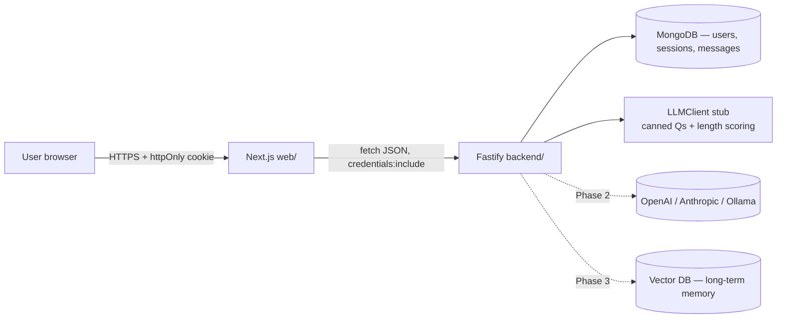
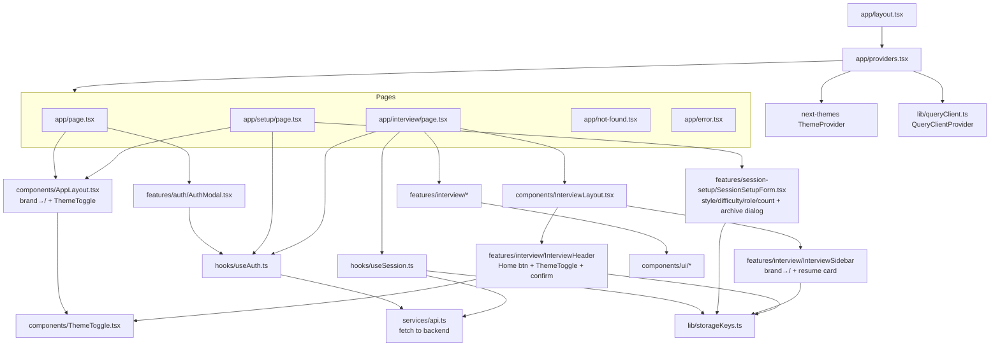
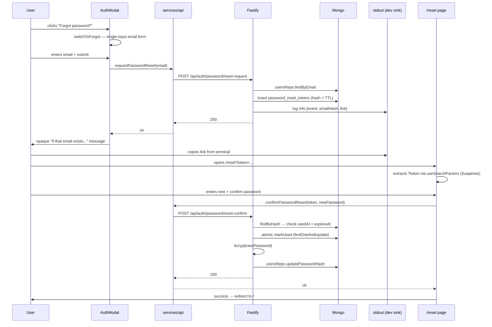
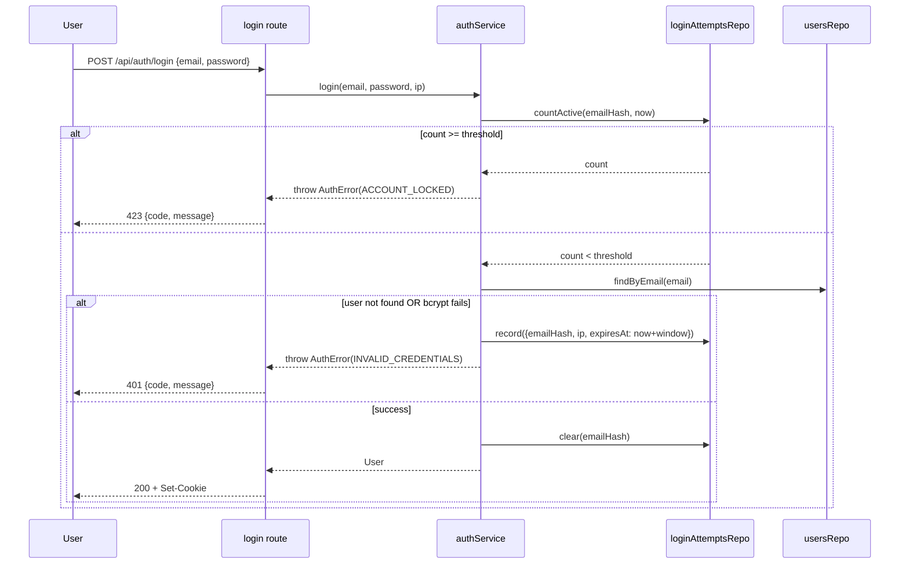
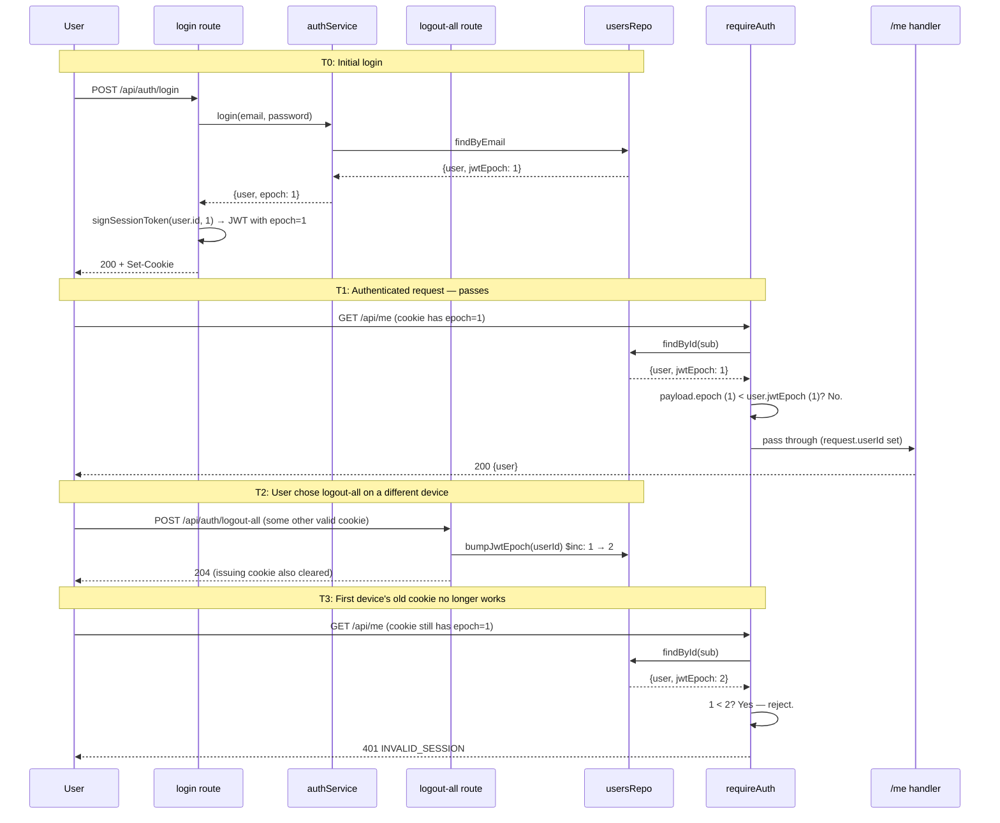
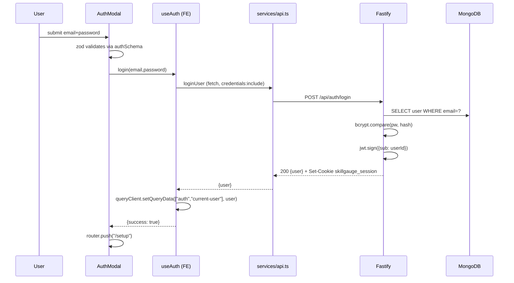
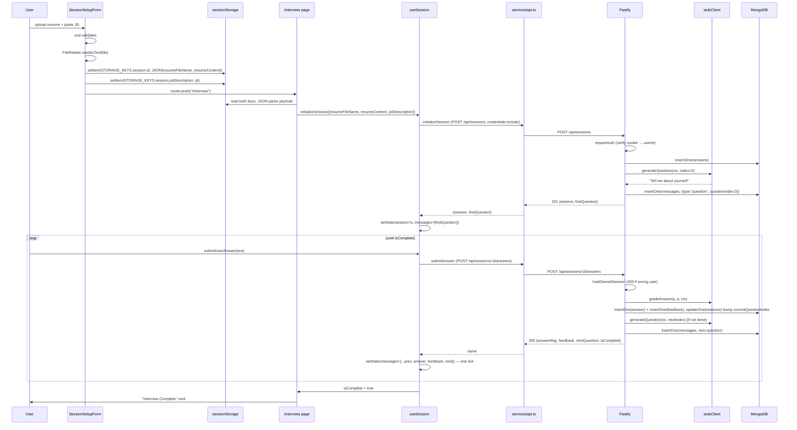

# SkillGauge — Architecture

Living architecture reference. **Update this file in the same commit as any structural change** (new module, new route, new service, phase transition).

**Current phase:** Phase 2a/2e complete in placeholder mode — both `OpenAILLMClient` and `AnthropicLLMClient` adapter classes shipped + tested with mocked SDKs. Phase 1.5 + 1.6 + 2b all fully complete. Next: Phase 2c (PDF + DOCX parsing). Smoke-testing against a real LLM provider needs an API key in `.env`; see [requirements.md §10](requirements.md).
**Last updated:** 2026-04-25
**Scope of this doc:** Full stack — FE (Next.js) in [web/](web/) and BE (Fastify + MongoDB) in [backend/](backend/). The AI layer ships three implementations of `LLMClient`: a deterministic `stubClient` (default), an `OpenAILLMClient`, and an `AnthropicLLMClient`. All three consume the same v1 prompts in `backend/src/llm/prompts/v1/`.
**Test baseline:** 75 BE + 39 FE = 114 Jest tests, all green. CI runs both suites in parallel.

---

## 1. Project overview

SkillGauge is an AI-powered interview preparation platform. A user uploads a resume, pastes a target job description, and practices interview questions in a chat-style UI while the system tracks progress over time.

**What exists today (end of Phase 1.1):**
- Next.js 16 App Router FE in [web/](web/) with light/dark themes via `next-themes`
- Fastify 5 + TypeScript BE in [backend/](backend/) with MongoDB persistence (`mongodb` driver)
- httpOnly cookie JWT auth (`@fastify/cookie` + `jsonwebtoken` + `bcryptjs`)
- `LLMClient` interface with `stubClient` — canned questions organized by interview style + difficulty, length-proxy grading scaled by difficulty
- Rich setup form — interview style, difficulty, role level, question count, optional focus areas — all persisted on the session doc and threaded through every LLM call
- Resume + active-session are surfaced in the interview sidebar; navigating away mid-session is guarded with a confirm dialog; swapping resume archives the previous snapshot locally
- Real HTTP between FE ↔ BE via `fetch` with `credentials: "include"`
- 23 Jest tests on FE + 13 Jest tests on BE = 36 total, green in CI
- Parallel CI jobs for `web/` and `backend/` in a single workflow

**What is planned:**
- Auth hardening sub-phases (password reset, rate limits, session rotation, contract cleanup) — Phase 1.5b–e
- UI polish & visibility: persistent logout, expanded homepage, active LLM provider badge, chatroom-style sidebar — Phase 1.6
- Provider-agnostic prompt templates land **first**, then real LLM providers (OpenAI / Anthropic) as thin adapters — Phase 2
- Vector DB for long-term memory across sessions, real chatroom sidebar backed by `GET /api/sessions`, full transcript history view — Phase 3
- Progress dashboard + analytics — Phase 3
- E2E tests, observability, deploy, rate limits — Phase 4

---

## 2. Tech stack

### Frontend ([web/](web/))

| Concern | Tool | Version | Where |
|---|---|---|---|
| Framework | Next.js (App Router) | 16.2.4 | [web/](web/) |
| UI library | React + React DOM | 19.2.4 | [web/](web/) |
| Language | TypeScript | ^5 | [web/tsconfig.json](web/tsconfig.json) |
| Styling | Tailwind CSS | ^4 | [web/app/globals.css](web/app/globals.css) |
| Theming | next-themes (light/dark/system) | ^0.4.x | [web/app/providers.tsx](web/app/providers.tsx), [ThemeToggle.tsx](web/components/ThemeToggle.tsx) |
| UI primitives | Radix UI (dialog, slot) + shadcn pattern | various | [web/components/ui/](web/components/ui/) |
| Icons | lucide-react | ^1.8.0 | used across components |
| Server state | @tanstack/react-query | ^5.99.1 | [web/lib/queryClient.ts](web/lib/queryClient.ts) |
| Form state | react-hook-form | ^7.72.1 | `features/*/` |
| Validation | zod | ^4.3.6 | `features/*/Schema.ts` |
| Resolver | @hookform/resolvers | ^5.2.2 | feature forms |
| Testing | Jest + RTL + jest-dom + user-event | Jest 30 / RTL 16 | [web/jest.config.ts](web/jest.config.ts) |
| Test env | jest-environment-jsdom | 30 | [web/jest.setup.ts](web/jest.setup.ts) |
| Lint | ESLint + eslint-config-next | 9 / 16.2.4 | [web/eslint.config.mjs](web/eslint.config.mjs) |
| Build | Next.js + Turbopack | 16.2.4 | [web/next.config.ts](web/next.config.ts) |

### Backend ([backend/](backend/))

| Concern | Tool | Version | Where |
|---|---|---|---|
| HTTP server | Fastify | ^5.8.5 | [backend/src/app.ts](backend/src/app.ts) |
| Language | TypeScript (CommonJS output) | ^5.9.3 | [backend/tsconfig.json](backend/tsconfig.json) |
| DB driver | mongodb (official Node driver, async) | ^7.1.1 | [backend/src/db/connection.ts](backend/src/db/connection.ts) |
| Auth cookies | @fastify/cookie | ^11.0.2 | [backend/src/plugins/auth.ts](backend/src/plugins/auth.ts) |
| CORS | @fastify/cors | ^11.2.0 | [backend/src/app.ts](backend/src/app.ts) |
| JWT | jsonwebtoken | ^9.0.3 | [backend/src/plugins/auth.ts](backend/src/plugins/auth.ts) |
| Password hashing | bcryptjs (pure JS — Windows-safe) | ^3.0.3 | [backend/src/modules/auth/auth.service.ts](backend/src/modules/auth/auth.service.ts) |
| Validation | zod (shared with FE) | ^4.3.6 | [backend/src/modules/**/*.schema.ts](backend/src/modules/) |
| Env parsing | dotenv + zod | ^17.4.2 | [backend/src/config/env.ts](backend/src/config/env.ts) |
| Dev runner | tsx (watch mode) | ^4.21.0 | `npm run dev` |
| Testing | Jest + ts-jest (via `app.inject()`) | 30 / 29.4.9 | [backend/jest.config.ts](backend/jest.config.ts) |
| Test DB | mongodb-memory-server (per-suite mongod) | ^11.0.1 | [backend/tests/mongoHarness.ts](backend/tests/mongoHarness.ts) |

### Repo-wide

| Concern | Tool | Where |
|---|---|---|
| CI | GitHub Actions (parallel `web` + `backend` jobs) | [.github/workflows/ci.yml](.github/workflows/ci.yml) |

---

## 3. Folder structure

```
SkillGauge/
├── ARCHITECTURE.md              ← this file
├── PROGRESS.md                  ← living build log (phase checklists + changelog)
├── IMPLEMENTATION_STATUS.md     ← what is / isn't built, reconciled per phase
├── README.md                    ← top-level intro, run instructions
├── .github/
│   └── workflows/ci.yml         ← parallel web + backend jobs
├── backend/                     ← Fastify 5 HTTP API (Phase 1)
│   ├── src/
│   │   ├── config/env.ts        ← zod-validated env schema
│   │   ├── db/
│   │   │   ├── connection.ts    ← MongoClient singleton + getDb() + closeDb()
│   │   │   ├── indexes.ts       ← ensureIndexes() — unique email + partial unique question slots
│   │   │   └── repos/           ← data access (users / sessions / messages collections)
│   │   ├── llm/
│   │   │   ├── LLMClient.ts     ← provider-agnostic interface (context includes style/difficulty/roleLevel)
│   │   │   ├── stubClient.ts    ← behavioral / technical-by-difficulty / mixed banks + role-suffix + length-proxy scoring
│   │   │   └── index.ts         ← factory switch on LLM_PROVIDER
│   │   ├── plugins/
│   │   │   └── auth.ts          ← JWT sign/verify + cookie set + requireAuth hook
│   │   ├── modules/
│   │   │   ├── auth/            ← routes + service + zod schema
│   │   │   ├── sessions/        ← session init + questions + answers (protected)
│   │   │   └── health/          ← GET /api/health
│   │   ├── shared/types.ts      ← User / Session / Message / AuthResponse
│   │   ├── app.ts               ← buildApp() factory (separate from listen)
│   │   └── index.ts             ← main() bootstrap
│   ├── tests/
│   │   ├── auth.test.ts         ← 6 tests (register/login/me/logout/errors)
│   │   ├── sessions.test.ts     ← 5 tests (init + Q&A + ownership + errors)
│   │   ├── setup.ts             ← NODE_ENV=test, JWT_SECRET, LLM_PROVIDER=stub
│   │   └── mongoHarness.ts      ← per-suite mongodb-memory-server lifecycle
│   ├── .env.example
│   ├── jest.config.ts
│   ├── package.json             ← scripts: dev / build / start / test / typecheck / migrate
│   └── tsconfig.json            ← CommonJS + Node resolution + @/* paths
└── web/                         ← Next.js 16 App Router app
    ├── app/                     ← App Router pages + root layout
    │   ├── layout.tsx           ← root HTML + <Providers> (suppressHydrationWarning for next-themes)
    │   ├── providers.tsx        ← ThemeProvider + QueryClientProvider (client, lazy-init)
    │   ├── page.tsx             ← /         landing
    │   ├── setup/page.tsx       ← /setup    upload resume + JD + interview options
    │   ├── interview/page.tsx   ← /interview Q&A transcript
    │   ├── not-found.tsx        ← 404
    │   ├── error.tsx            ← runtime error boundary
    │   └── globals.css          ← Tailwind 4 @theme tokens + .dark palette + animation utils
    ├── components/
    │   ├── AppLayout.tsx        ← top-nav shell (brand→/, ThemeToggle)
    │   ├── InterviewLayout.tsx  ← sidebar/header/main shell
    │   ├── ThemeToggle.tsx      ← Sun/Moon toggle, mounted-gated
    │   └── ui/                  ← shadcn primitives
    ├── features/
    │   ├── auth/                ← AuthModal + authSchema
    │   ├── session-setup/       ← SessionSetupForm (resume + JD + style/difficulty/roleLevel/count/focusAreas)
    │   │                          + sessionSetupSchema (+ archive-confirm Dialog)
    │   └── interview/           ← MessageBubble, AnswerInput, InterviewHeader (home+theme), InterviewSidebar (resume card)
    ├── hooks/
    │   ├── useAuth.ts           ← /me query + login/register/logout mutations
    │   └── useSession.ts        ← init + answer mutations (single atomic append)
    ├── lib/
    │   ├── queryClient.ts       ← QueryClient factory
    │   ├── storageKeys.ts       ← STORAGE_KEYS (session: id, jobDescription, options, archived, active)
    │   └── utils.ts             ← cn() className merger
    ├── services/
    │   └── api.ts               ← real HTTP client (credentials: "include")
    ├── test/queryWrapper.tsx
    ├── .env.local.example       ← NEXT_PUBLIC_API_BASE_URL
    ├── jest.config.ts
    ├── jest.setup.ts
    ├── next.config.ts
    ├── tsconfig.json
    └── package.json
```

---

## 4. System context



Solid edges = implemented today. Dashed edges = planned.

---

## 5. Frontend module map



---

## 6. Backend module map

```mermaid
flowchart TB
  index[src/index.ts<br/>bootstrap] --> app[src/app.ts<br/>buildApp factory]
  app --> cors[@fastify/cors]
  app --> cookie[@fastify/cookie]
  app --> authPlugin[plugins/auth.ts<br/>JWT + cookie + requireAuth]
  app --> healthR[modules/health]
  app --> authR[modules/auth/auth.routes.ts]
  app --> sessR[modules/sessions/sessions.routes.ts]

  authR --> authS[auth.service.ts]
  authR --> authSchema[auth.schema.ts]
  sessR --> sessS[sessions.service.ts]
  sessR --> sessSchema[sessions.schema.ts]
  sessR -.preHandler.-> authPlugin

  authS --> userRepo[db/repos/users.ts]
  sessS --> sessRepo[db/repos/sessions.ts]
  sessS --> msgRepo[db/repos/messages.ts]
  sessS --> llm[llm/index.ts → stubClient]

  userRepo --> conn[db/connection.ts<br/>MongoClient]
  sessRepo --> conn
  msgRepo --> conn
  app -.on boot.-> indexes[db/indexes.ts<br/>ensureIndexes]

  app --> env[config/env.ts<br/>zod-validated]
```

---

## 7. HTTP surface (real, implemented)

| Method | Path | Auth | Body | Returns | Source |
|---|---|---|---|---|---|
| GET | `/api/health` | public | — | `{ ok: true }` | [health.routes.ts](backend/src/modules/health/health.routes.ts) |
| POST | `/api/auth/register` | public | `{ email, password }` | `201 { user }` + Set-Cookie | [auth.routes.ts](backend/src/modules/auth/auth.routes.ts) |
| POST | `/api/auth/login` | public | `{ email, password }` | `200 { user }` + Set-Cookie | [auth.routes.ts](backend/src/modules/auth/auth.routes.ts) |
| POST | `/api/auth/logout` | public | — | `204` + clear cookie | [auth.routes.ts](backend/src/modules/auth/auth.routes.ts) |
| GET | `/api/me` | cookie | — | `200 { user }` or `401` | [auth.routes.ts](backend/src/modules/auth/auth.routes.ts) |
| POST | `/api/sessions` | cookie | `SessionInitRequest` | `201 { session, firstQuestion }` | [sessions.routes.ts](backend/src/modules/sessions/sessions.routes.ts) |
| GET | `/api/sessions/:id/questions/:index` | cookie | — | `200 Message` (idempotent) | [sessions.routes.ts](backend/src/modules/sessions/sessions.routes.ts) |
| POST | `/api/sessions/:id/answers` | cookie | `{ answer }` | `200 { answerMsg, feedback, nextQuestion, isComplete }` | [sessions.routes.ts](backend/src/modules/sessions/sessions.routes.ts) |

**Key shape choices vs. Phase 0b mock:**
- `POST /api/sessions` returns `{ session, firstQuestion }` atomically — FE never renders a sessionless state.
- `POST /api/sessions/:id/answers` returns all four fields in one round-trip → FE appends `[answer, feedback, next]` in a single `setState`, avoiding flicker.
- `GET /api/sessions/:id/questions/:index` is idempotent — page refresh or race doesn't consume another LLM call.
- No `token` field in auth responses — the cookie is the session.

---

## 8. Database schema

MongoDB via the official `mongodb` driver. Three collections, all using UUID strings as `_id` (chosen over `ObjectId` so the FE contract — plain string IDs — stays stable when swapping providers). Indexes are created idempotently on server boot via `ensureIndexes()` (also runnable as `npm run migrate`). Source: [backend/src/db/indexes.ts](backend/src/db/indexes.ts), [backend/src/db/repos/](backend/src/db/repos/).

### `users`
```ts
{
  _id: string,            // uuid
  email: string,          // lowercased
  passwordHash: string,   // bcryptjs, 10 rounds
  name?: string,
  createdAt: string,      // ISO 8601
}
```
Index: `{ email: 1 }` **unique**.

### `sessions`
```ts
{
  _id: string,
  userId: string,                 // FK → users._id (enforced in app, not DB)
  title: string,                  // derived e.g. "Mid Mixed Interview"
  totalQuestions: number,         // from request.questionCount (3 | 5 | 7 | 10)
  currentQuestionIndex: number,   // defaults to 0
  status: "active" | "completed",
  resumeFileName: string,
  resumeContent: string,
  jobDescription: string,
  interviewStyle: "behavioral" | "technical" | "mixed",
  difficulty: "easy" | "medium" | "hard",
  roleLevel: "junior" | "mid" | "senior" | "lead",
  focusAreas?: string,
  createdAt: string,
}
```
Index: `{ userId: 1 }`.

### `messages`
```ts
{
  _id: string,
  sessionId: string,              // FK → sessions._id
  type: "question" | "answer" | "feedback",
  content: string,
  questionIndex?: number,         // present only on type: "question"
  feedback?: { score: number, strengths: string[], improvements: string[] },  // subdoc on type: "feedback"
  createdAt: string,
}
```
Indexes:
- `{ sessionId: 1 }` — list-by-session
- `{ sessionId: 1, questionIndex: 1 }` **unique**, partial filter `{ type: "question", questionIndex: { $exists: true } }` — enforces at-most-one question per slot at the storage layer, so idempotent re-reads of `GET /api/sessions/:id/questions/:index` can't race-create duplicates.

**Why strings not ObjectId:** keeps the wire contract identical to Phase 0b mock (opaque string IDs) and avoids an FE migration. Storage penalty is negligible at this scale.

**No FK enforcement:** referential integrity is enforced in application code (`loadOwnedSession` 403s on user/session mismatch). This is the standard Mongo trade-off — gains schema flexibility, loses DB-level cascade.

**Ownership enforcement:** every session read/write goes through `loadOwnedSession(userId, sessionId)` in [sessions.service.ts](backend/src/modules/sessions/sessions.service.ts), which 403s if the session's `userId` doesn't match the JWT's `sub`. No route handler does its own ownership check.

---

## 9. Auth model

Source: [backend/src/plugins/auth.ts](backend/src/plugins/auth.ts), [backend/src/modules/auth/auth.service.ts](backend/src/modules/auth/auth.service.ts), [web/services/api.ts](web/services/api.ts).

**On login/register:**
1. BE verifies credentials (bcryptjs compare).
2. BE signs JWT: `{ sub: userId }`, HS256, expiry from `env.JWT_TTL_DAYS` (default 7).
3. BE sets cookie `skillgauge_session`: `httpOnly`, `sameSite=lax`, `secure` in prod, `path=/`, `maxAge` matched to `JWT_TTL_DAYS`.
4. FE never sees the token — browser just echoes the cookie on future same-origin (or `credentials: "include"` cross-origin) requests.

**On every protected route:** `requireAuth` `preHandler` reads the cookie, verifies the JWT, loads the user, sets `request.user`. Missing/expired/tampered cookie → 401.

**Logout:** `POST /api/auth/logout` clears the cookie. FE also calls `queryClient.clear()` to drop cached server state.

**FE auth state:** `useAuth` owns one query — `queryKey: ["auth","current-user"]`, `queryFn: fetchMe` (returns `null` on 401). No more localStorage. `isAuthenticated` = `user !== null && !isLoading`.

**Error contract (Phase 1.5a).** Every `/api/auth/*` failure and every `requireAuth` 401 returns a `{code, message}` JSON body. `code` is machine-readable; `message` is the human-readable string the FE can display directly. Codes in use today:

| Code | Status | Where |
|---|---|---|
| `INVALID_FORMAT` | 400 | `register` / `login` zod parse failure |
| `EMAIL_TAKEN` | 409 | `register` duplicate email |
| `INVALID_CREDENTIALS` | 401 | `login` wrong email or password (intentionally not distinguished — no enumeration) |
| `NOT_AUTHENTICATED` | 401 | `requireAuth` with no cookie |
| `INVALID_SESSION` | 401 | `requireAuth` with expired / tampered / wrong-secret cookie |
| `USER_NOT_FOUND` | 401 | `/api/me` when the JWT verifies but the user has been deleted |
| `INVALID_TOKEN` | 400 | `/api/auth/password/reset-confirm` when the reset token is unknown / expired / already used / lost a race (Phase 1.5b) |
| `ACCOUNT_LOCKED` | 423 | `/api/auth/login` when the per-email failure count reached the threshold (Phase 1.5c) |
| `RATE_LIMIT_EXCEEDED` | 429 | Any rate-limited route (`/api/auth/login`, `/api/auth/password/reset-request`) when the per-IP cap is hit (Phase 1.5c) |
| `SESSION_NOT_FOUND` | 404 | Any session route when the `:id` doesn't resolve (Phase 1.5e) |
| `SESSION_FORBIDDEN` | 403 | Any session route when the session belongs to another user (Phase 1.5e) |
| `SESSION_COMPLETED` | 409 | `POST /api/sessions/:id/answers` after `isComplete` (Phase 1.5e) |
| `SESSION_INDEX_MISMATCH` | 409 | `GET /api/sessions/:id/questions/:index` when caller asked for question N but session is on M (Phase 1.5e) |

All wire-level zod schemas live in [backend/src/shared/contracts.ts](backend/src/shared/contracts.ts) as of Phase 1.5e — single source of truth, no per-module schema drift. The mapping from internal `SessionError.code` to wire-level `SESSION_*` code is centralized in two helper functions (`statusForSessionError`, `codeForSessionError`) inside [sessions.routes.ts](backend/src/modules/sessions/sessions.routes.ts).

Sessions and health routes still emit the legacy `{error}` shape — Phase 1.5e's shared-contracts pass will sweep them. The FE [`apiFetch`](web/services/api.ts) reads `body.code` + `body.message` first and falls back to `body.error`, so both shapes coexist on the wire today.

**Failed-login audit log (Phase 1.5a).** Every failed login (wrong creds OR malformed payload) emits a single Fastify pino warn line:
```json
{"event":"auth.login.failed","ip":"<remote>","emailHash":"<sha256-prefix>","reason":"<AuthError code>"}
```
The email hash uses `hashEmailForLog` ([backend/src/shared/audit.ts](backend/src/shared/audit.ts)) — SHA-256 over the trimmed/lowercased email, first 16 hex chars. Raw email and password are never logged. Phase 1.5c will count these per `(ip, emailHash)` to drive rate limiting and soft lockout.

### 9.1 How the session token is built and verified

The JWT is the *only* thing that proves identity on a request. The cookie is just transport. Mechanics, end to end:

**(a) Anatomy of one of our tokens.** A signed JWT is three base64url-encoded segments joined by dots: `<header>.<payload>.<signature>`. For our tokens:

```
header   = base64url({"alg":"HS256","typ":"JWT"})
payload  = base64url({"sub":"<userId-uuid>","epoch":<int>,"iat":<unix-ts>,"exp":<unix-ts + JWT_TTL_DAYS*86400>})
signature = HMAC-SHA256(<header>.<payload>, JWT_SECRET)
```

`sub` carries the user's UUID. `epoch` (Phase 1.5d) is the user's `jwtEpoch` at sign time — see §9.4 for how this powers per-user "log out everywhere" without rotating the global secret. `iat` (issued-at) and `exp` (expiry) are added by [`jsonwebtoken`](https://www.npmjs.com/package/jsonwebtoken) automatically when we pass `expiresIn`. The signature binds header + payload to our secret; flipping any byte in either segment makes the signature invalid. The full token is opaque to the FE — only the BE knows `JWT_SECRET`.

**(b) Signing — happens on register and login** ([signSessionToken](backend/src/plugins/auth.ts)):
```ts
jwt.sign({ sub: userId, epoch }, env.JWT_SECRET, { expiresIn: `${env.JWT_TTL_DAYS}d` })
```
`expiresIn: "7d"` is parsed by `jsonwebtoken` to seconds and added to `iat` to compute `exp`. Single source of truth for TTL: `env.JWT_TTL_DAYS` (default 7) drives both this and the cookie's `Max-Age` (`60 * 60 * 24 * env.JWT_TTL_DAYS = 604800` seconds for 7 days). Change one env var, both update consistently. `epoch` is the user's `jwtEpoch` *at sign time* — pulled from the user doc the route already loads to verify the password.

**(c) Cookie transport** ([setSessionCookie](backend/src/plugins/auth.ts)):
```
Set-Cookie: skillgauge_session=<jwt>; Max-Age=604800; Path=/; HttpOnly; SameSite=Lax[; Secure]
```
- **`HttpOnly`** — JS in the browser can't read `document.cookie` for this entry, so an XSS payload can't exfiltrate the token. (Phase 1's biggest win over the Phase 0 localStorage scheme.)
- **`SameSite=Lax`** — the browser only attaches the cookie on top-level navigations and same-site requests. Cross-site `POST` from `evil.com` to `/api/auth/login` won't carry it → CSRF blocked for state-changing verbs. Top-level GET still works (e.g. clicking a magic link).
- **`Path=/`** — every route under our origin gets the cookie. We don't scope tighter because `/api/me` and `/api/sessions/*` both need it.
- **`Secure`** — only emitted in `NODE_ENV=production`. Localhost dev uses plain HTTP, so omitting `Secure` there is required for the cookie to be set at all. Prod must run on HTTPS or the cookie won't reach the BE.
- **`Max-Age`** — browser-side expiry. Matches JWT's `exp` so the browser stops sending the cookie at the same moment the server stops accepting it.

**(d) Verification — happens on every protected request** ([requireAuth](backend/src/plugins/auth.ts)):
```ts
const payload = jwt.verify(token, env.JWT_SECRET) as { sub: string; epoch: number }
const user = await usersRepo.findById(payload.sub)
if (!user || (payload.epoch ?? 1) < (user.jwtEpoch ?? 1)) reject INVALID_SESSION
request.userId = payload.sub
```
Five checks, all collapsed to one `INVALID_SESSION` 401:
1. **Signature** — `jwt.verify` recomputes HMAC-SHA256 with `JWT_SECRET` and compares. Fails on tamper, wrong secret, or any byte flip.
2. **Expiry** — `jwt.verify` checks `exp > now` automatically.
3. **Payload shape** — `jwt.verify` rejects garbage / unparseable.
4. **User exists** — Phase 1.5d hits Mongo via `findById`. If the user was deleted while their session was live, treat as logged out (vs. an awkward 200 from `/me` followed by silent breakage on the next protected route).
5. **Epoch fresh** — Phase 1.5d compares `payload.epoch` against `user.jwtEpoch`. If the user has since logged-out-everywhere or reset their password, every token signed pre-bump is now stale.

We deliberately don't distinguish in the response *which* check failed — an attacker probing a stolen cookie should get no hint about whether it's expired, tampered, or just out of date. Pino logs at debug level have the breakdown for developers.

**(e) Cross-origin handshake.** FE on `:3000`, BE on `:4000` is cross-origin. Two settings make the cookie ride:
- BE: `@fastify/cors` with `credentials: true` and an explicit `origin` (never `*` — the spec rejects it when credentials are on).
- FE: every `fetch` call goes through `apiFetch` ([web/services/api.ts](web/services/api.ts)) with `credentials: "include"`.
Without both, the browser silently drops the `Set-Cookie` (silently, no console error — debugging this is painful, hence the centralized `apiFetch`).

**(f) What rotation looks like.** Bumping `JWT_SECRET` invalidates every existing token instantly (every signature now mismatches), so every user is logged out and their next request returns 401. Currently this means an unannounced downtime moment — Phase 1.5d will add `jwt_epoch` per user so we can rotate gracefully without booting everyone.

**(g) What's *not* in the JWT.** No email, no roles, no permissions. Just `sub`. Every request that needs more than the user ID hits Mongo via `usersRepo.findById`. Trade-off: extra DB read per request, but tokens stay tiny + we never have to worry about stale claims (e.g. role changes take effect immediately, no need to wait for token expiry).

### 9.2 Password reset flow (Phase 1.5b)

The reset flow is two-stage: **request** → email link → **confirm**. Each stage is a separate route with deliberate properties chosen to defend against the common attacks (enumeration, replay, brute force, race).

**(a) New collection: `password_reset_tokens`** ([repo](backend/src/db/repos/passwordResetTokens.ts)).

| Field | Type | Why it's there |
|---|---|---|
| `_id` | UUID string | Random handle; never user-facing |
| `userId` | UUID string | FK to the user this token can reset |
| `tokenHash` | SHA-256 hex (64 chars) | The plain token's hash. **The plain token never lives in the DB.** A leaked DB doesn't expose live tokens — an attacker would need both the leak *and* the email link |
| `expiresAt` | Date | TTL index → Mongo auto-deletes expired docs within ~60s of expiry. No cron job needed |
| `usedAt` | Date \| null | Single-use enforcement. `findOneAndUpdate({_id, usedAt: null}, {$set: {usedAt: now}})` is atomic, so two parallel confirms can't both succeed |
| `createdAt` | Date | Audit only |

Indexes: unique on `tokenHash` (collision protection); TTL on `expiresAt` (auto-cleanup).

**(b) Request — `POST /api/auth/password/reset-request`** ([routes](backend/src/modules/auth/auth.routes.ts), [service](backend/src/modules/auth/password.service.ts)):

```
{email} → 200 (empty body) — ALWAYS
```

Returns the same opaque 200 whether the email exists or not. **Why**: distinguishing "email registered" from "email unknown" is exactly the signal credential-stuffing attackers want. We deny it. Internally:
1. Zod normalizes email (trim + lowercase + format).
2. `usersRepo.findByEmail(email)` — if no user, no-op silently. The route still returns 200.
3. If user exists: generate 32 bytes (256 bits) of randomness → hex → 64 chars; SHA-256-hex it; insert a token doc with `expiresAt = now + RESET_TTL_MIN` (default 30 min); return the plain token to the route layer.
4. The route logs `request.log.info({event: "auth.password.reset_link_issued", emailHash, link})` — **never the raw email**. Phase 4 swaps this `info` line for a transactional mail send (SES / Resend / Postmark).

`emailHash` is the same SHA-256 prefix from `hashEmailForLog` used by the failed-login audit log — letting Phase 1.5c correlate "request rate" per actor without storing emails in logs.

**(c) Confirm — `POST /api/auth/password/reset-confirm`**:

```
{token (64 hex), newPassword (6+ chars)} → 200 (empty body) | 400 INVALID_TOKEN | 400 INVALID_FORMAT
```

Procedure:
1. Zod validates token shape (64 hex chars) + password length. Format failures return 400 `INVALID_FORMAT` *before* any DB lookup.
2. SHA-256 the incoming plain token; lookup by `tokenHash`.
3. **Four checks, all collapsed to `INVALID_TOKEN`**:
   - Token not found.
   - `usedAt !== null` (already consumed).
   - `expiresAt <= now` (caught even if Mongo's TTL sweeper hasn't fired yet).
   - Atomic `markUsed` lost a race (parallel confirm; the loser's update returned null).
4. bcrypt the new password; call `usersRepo.updatePasswordHash`.

**Why one error code, not four?** Distinguishing "expired" from "already used" from "wrong" gives an attacker an oracle for probing token state. We don't help them.

**(d) FE flow** ([AuthModal.tsx](web/features/auth/AuthModal.tsx), [/reset page](web/app/reset/page.tsx), [PasswordResetForm.tsx](web/features/auth/PasswordResetForm.tsx)):



**(e) Known gap — closed in 1.5d.** Confirming a reset does **not** invalidate the user's existing session cookie today. If an attacker phished a reset link, the user's old cookie still works until natural JWT expiry. Phase 1.5d adds `jwtEpoch` per user; resetting the password will bump the epoch, which `requireAuth` checks → all old tokens become `INVALID_SESSION` instantly. The `password.service.ts` `confirmReset` already has a `// TODO:phase-1.5d` marker on the exact line where the bump will go.

### 9.3 Rate limit + lockout (Phase 1.5c)

Two layers of defense in front of the login surface, addressing two different attacker shapes:

| Layer | Defends against | Storage | Counts by | Response |
|---|---|---|---|---|
| **Per-IP rate limit** | A single attacker source firing many requests | In-process LRU (via `@fastify/rate-limit`) | `request.ip` | 429 `RATE_LIMIT_EXCEEDED` |
| **Per-email lockout** | A distributed credential-stuffing campaign across many IPs targeting one account | Mongo `login_attempts` collection (TTL'd) | `hashEmailForLog(email)` | 423 `ACCOUNT_LOCKED` |

**Why both?** Per-IP alone fails when an attacker rotates IPs (botnets, residential proxies). Per-email alone fails when an attacker spreads thin across many emails. Together they create a defense matrix where neither shape of attack succeeds.

**(a) Per-IP rate limit** ([plugin](backend/src/plugins/rateLimit.ts), [config](backend/src/app.ts)):

```
@fastify/rate-limit registered globally with `global: false` (opt-in).
Routes opt in via `config.rateLimit: { max: AUTH_RATE_PER_MIN, timeWindow: "1 minute" }`.
Hot routes today: POST /api/auth/login, POST /api/auth/password/reset-request.
```

Storage is the plugin's default in-process LRU keyed by IP. Trade-offs:
- ✅ No extra service (Phase 1 is single-process; matches our "no new infra without justification" rule).
- ❌ Counter resets on process restart and doesn't share across instances. **TODO:phase-4** swap to Redis (`@fastify/rate-limit` supports it natively, just a config change) when we deploy multi-instance.

Body shape on 429 is hand-set via `errorResponseBuilder` so it matches our project-wide `{code, message}` contract — the plugin's default body would have been `{statusCode, error, message}`.

**Why register, but not login**: register has a built-in throttle — a duplicate email returns 409 `EMAIL_TAKEN`, so a brute-force registrar can only create one account per (email × bcrypt-cost) ≈ 100ms. Login + reset-request are the actually-exposed credential-probe surfaces.

**(b) Per-email soft lockout** ([service](backend/src/modules/auth/auth.service.ts), [repo](backend/src/db/repos/loginAttempts.ts)):

Storage:

| Field | Notes |
|---|---|
| `_id` | UUID — random handle |
| `emailHash` | SHA-256-first-16-hex via `hashEmailForLog`. Same hash function as the failed-login pino audit line, so 1.5c's count and 1.5a's logs correlate during incident response |
| `ip` | Forensics only — not used in the count |
| `failedAt` | When |
| `expiresAt` | TTL (Mongo auto-deletes after `LOGIN_LOCKOUT_WINDOW_MIN`) |

Indexes: compound `(emailHash, expiresAt)` for fast `countActive`; standalone TTL on `expiresAt`.

Login flow:


**Three deliberate design choices**:

1. **Lockout check runs *before* bcrypt.** Counting failures pre-hash means a locked account doesn't waste 100ms+ of CPU on each rejected attempt. Under attack this prevents a CPU-burn DoS that could otherwise saturate the BE just rejecting requests.

2. **Unknown emails count toward the lockout too.** `ghost@example.com` failing 5 times locks out as `ghost@example.com` for the next 15 minutes. If we only counted known emails, an attacker could probe "this email locks → registered; this one keeps returning 401 forever → unregistered." Counting both eliminates the timing/behavior difference.

3. **Successful login explicitly clears the streak** (not just relying on TTL). The TTL would clean up eventually, but `clear(emailHash)` after a verified password is the correct semantic: the user proved ownership, the streak is over. Otherwise a user who failed 4 times then succeeded then failed once would be at 5 active failures → lockout. Surprising and wrong.

**(c) Status code semantics — why 423 vs 429**:

- **`429 Too Many Requests`** is the per-IP layer. The IP is sending too many requests, period. Recovery: wait, or change networks.
- **`423 Locked` (RFC 4918)** is the per-email layer. The *resource* (the account) is locked. Recovery: wait the window OR reset the password (the message tells the user both).

The FE can branch on `response.status` to show the right UX. A future Phase 1.6 enhancement could show a countdown timer for 423s but a generic "try again" for 429s.

**(d) Tunables** (env, all optional):

| Var | Default | What it controls |
|---|---|---|
| `AUTH_RATE_PER_MIN` | 10 | Per-IP requests/minute on hot auth routes |
| `LOGIN_LOCKOUT_THRESHOLD` | 5 | Failed attempts before soft lockout |
| `LOGIN_LOCKOUT_WINDOW_MIN` | 15 | Window length AND lockout duration |

**TODO:phase-4** ship rate-limit storage to Redis so multi-instance deploys share state. Until then, the limits multiply by N for an N-instance fleet — manageable but a footgun to track.

### 9.4 Session rotation via `jwt_epoch` (Phase 1.5d)

Bumping a per-user counter ("epoch") instantly invalidates every token signed before the bump. Powers two flows:

| Flow | Why bump? |
|---|---|
| `POST /api/auth/logout-all` | User chose "sign me out everywhere" — could be after a lost laptop, suspicious activity, or just hygiene |
| Password reset confirm | Mandatory: a successful reset MUST kick out any session an attacker may already be holding (e.g., from a prior phish) |

**(a) Storage** ([users repo](backend/src/db/repos/users.ts)):

`UserDoc.jwtEpoch?: number` — optional for back-compat with pre-1.5d docs. Service-layer `epochOf(doc)` helper centralizes the `?? 1` fallback. Fresh registrations set `jwtEpoch: 1`.

`bumpJwtEpoch(id)` is one atomic `$inc: { jwtEpoch: 1 }` call. Mongo's `$inc` on a missing field starts from 0 → first bump on a legacy doc lands at 1; combined with the `?? 1` fallback in `signSessionToken` callers, this means the very first bump on a legacy user is harmless (epoch=1 token vs user.jwtEpoch=1 → equal, passes the `<` check). Subsequent bumps work normally. No migration needed.

**(b) Lifecycle**:



**(c) Why a per-user counter, not the global JWT_SECRET?**

Two ways to invalidate tokens en masse:
1. **Rotate `JWT_SECRET`** — invalidates *everyone's* tokens. Heavy hammer. Useful for a security incident where the secret may have leaked, but boots every user including the ones we don't suspect.
2. **Bump per-user `jwtEpoch`** — invalidates *one user's* tokens. Surgical. Right tool for "log me out of every device" or "this user just reset their password."

We support both: secret rotation is implicit (just change the env), epoch bumping is explicit (an endpoint or service call). Phase 1.5d ships epoch; future Phase 4 may add scripted secret rotation with `jwt_epoch_global` for graceful global rotation.

**(d) Three-rejection-paths-one-code** (continued from §9.1.d):

`requireAuth` now has three independent reject reasons, all returning 401 INVALID_SESSION:

1. Cryptographic signature failure (tampered / wrong secret / expired).
2. User row deleted while session was live.
3. Stale epoch (`payload.epoch < user.jwtEpoch`).

The wire response is identical for all three. Internally the pino debug log distinguishes them so developers can grep for "stale epoch" vs "user gone" during incident response. The uniformity prevents an attacker from probing "is this user deleted? did they bump their epoch? did my forged signature fail?" — no oracle.

**(e) Performance impact**:

Phase 1.5d adds **one `findById` per protected request**. Single indexed read, ~1ms in dev against Atlas. The user load was ALREADY happening on `/api/me` (post-`requireAuth`) — for other protected routes it's new overhead. Acceptable today; `TODO:phase-4` add a short-TTL user cache (Redis or in-memory LRU) keyed by userId if it becomes a hotspot.

---

## 10. LLM abstraction

Source: [backend/src/llm/](backend/src/llm/).

```ts
interface LLMClient {
  generateQuestion(ctx: QuestionContext): Promise<string>;
  gradeAnswer(q: string, a: string, ctx: QuestionContext): Promise<GradedAnswer>;
}
```

Three implementations ship today, all interchangeable via the `LLM_PROVIDER` env:

### 10.1 `stubClient` — deterministic default

`backend/src/llm/stubClient.ts`. Three question banks — `BEHAVIORAL_QUESTIONS` (10), `TECHNICAL_QUESTIONS_BY_DIFFICULTY` (10 per difficulty × 3), and a `mixed` interleave. Technical + mixed prompts get a `ROLE_SUFFIX` tail based on `roleLevel`. Scoring is a length proxy with a difficulty-scaled divisor (easy=10, medium=15, hard=25). No network, no key. Always available — used in tests and as the local-dev default.

The stub also calls `renderGenerateQuestion(ctx)` and `renderGradeAnswer(q, a, ctx)` and discards the rendered strings. This exercises the v1 prompt-template path on every CI run, so a future enum addition that misses `shared.ts` mappings fails loudly with a clear stack trace instead of waiting for a real provider to hit it.

### 10.2 `OpenAILLMClient` — `backend/src/llm/openaiClient.ts`

Thin wrapper around the official `openai` SDK + the v1 prompts from §10.4. Maps prompt output to OpenAI's chat-completions shape:

```ts
sdk.chat.completions.create({
  model: env.OPENAI_MODEL,
  messages: [{ role: "system", content: system }, { role: "user", content: user }],
  // grading only:
  response_format: { type: "json_object" },
})
```

JSON-mode is enforced for grading; question generation is plain text. We then `.parse()` the model's JSON with `gradeResponseSchema` — JSON-mode only guarantees parseable JSON, not that fields exist or fall in the right ranges, so the zod parse is the real shape gate.

### 10.3 `AnthropicLLMClient` — `backend/src/llm/anthropicClient.ts`

Mirrors OpenAI structurally but uses Claude-native conventions: `system` is a top-level parameter (not a message), and structured grading uses a forced tool call:

```ts
sdk.messages.create({
  model: env.ANTHROPIC_MODEL,
  system,                                            // top-level
  messages: [{ role: "user", content: user }],
  // grading only:
  tools: [GRADE_TOOL_SCHEMA],                        // mirrors gradeResponseSchema
  tool_choice: { type: "tool", name: "submit_grade" },
})
```

We extract the `tool_use` block from `message.content` and validate its `input` with `gradeResponseSchema`. `tool_choice` forces the model to call the grading tool — no risk of getting a free-form text reply we'd then have to JSON-parse.

### 10.4 v1 prompts (Phase 2b)

Both real adapters consume the SAME v1 renderers from `backend/src/llm/prompts/v1/`. Exports:
- `renderGenerateQuestion(ctx) → { system, user }`
- `renderGradeAnswer(q, a, ctx) → { system, user, responseSchema }`
- `gradeResponseSchema` — zod shape (`content`, `score: 1-10`, `strengths[1-5]`, `improvements[0-5]`)
- `PROMPT_VERSION = "v1"` — recorded on every persisted question + feedback message

Token-budget aware: résumé truncated to 4000 chars, JD to 2000, recent answers capped at 3.

### 10.5 Construction lifecycle + placeholder mode

[llm/index.ts](backend/src/llm/index.ts) is the factory. Service code (`sessions.service.ts`) calls `createLLMClient()` once at module load and stores the singleton. The factory:

| `LLM_PROVIDER` | `*_API_KEY` set? | Result |
|---|---|---|
| `stub` (default) | irrelevant | Returns `stubClient` — always works |
| `openai` | yes | Constructs `OpenAILLMClient` with `apiKey`, `model`, `timeout` |
| `openai` | **no** | **Throws** `LLM_PROVIDER=openai but OPENAI_API_KEY is not set...` — BE fails to BOOT |
| `anthropic` | yes | Constructs `AnthropicLLMClient` |
| `anthropic` | **no** | **Throws** equivalent error |

This is the "placeholder mode" pattern — real adapter classes are committed and compile-checked, but only instantiated when their key is present AND the provider is selected. Dev workflows without keys keep working with the stub; flipping `LLM_PROVIDER` in `.env` activates the real adapter.

### 10.6 Retry + timeout policy

Both real adapters wrap each SDK call in `callWithRetry`:
- One retry on transient: HTTP 5xx, 408, 429, or `Error.message` matching `ECONN*` / "timeout".
- No retry on permanent: 4xx other than 408/429 (almost always a prompt bug).
- 500 ms delay between attempts. Exponential backoff is overkill at one retry.

SDK-level `maxRetries: 0` so retries don't happen invisibly inside the SDK — we own the policy and log every transient.

### 10.7 What the FE sees

The interview header's [LlmBadge](web/components/LlmBadge.tsx) reads `GET /api/health/info` once on mount. Today it shows `🤖 stub` (the default); the moment ops drops a key in `.env` and flips `LLM_PROVIDER`, the next page load shows e.g. `🤖 anthropic · claude-sonnet-4-6`. Zero FE code change required for the swap — the badge already handles the populated-`llmModel` case.

This is the **AI integration seam**. Provider-specific bits (SDK shape, retry semantics, structured-output mechanism) live inside the adapter. Everything outside — prompts, persistence, request/response contracts, the FE — is provider-agnostic.

---

## 11. Rendering + routing (FE)

All pages statically optimized at build time; client interactivity is opted-in per component with `"use client"`.

| Path | File | Render | Client? | Hooks / features used |
|---|---|---|---|---|
| `/` | [web/app/page.tsx](web/app/page.tsx) | Static (SSG) | client | `useState`, `AuthModal` → `useAuth` |
| `/setup` | [web/app/setup/page.tsx](web/app/setup/page.tsx) | Static (SSG) | client | `useAuth`, `useRouter`, `SessionSetupForm` |
| `/interview` | [web/app/interview/page.tsx](web/app/interview/page.tsx) | Static (SSG) | client | `useAuth`, `useSession`, `useRouter`, interview components |
| 404 | [web/app/not-found.tsx](web/app/not-found.tsx) | Static | client | `usePathname` |
| Error | [web/app/error.tsx](web/app/error.tsx) | Runtime | client | Next.js error boundary contract |

---

## 12. Data flow — register + login



On hydrate of any page, `useAuth` runs `queryFn: fetchMe` → `GET /api/me`. 401 → user is null. 200 → user populates cache. No localStorage read.

---

## 13. Data flow — session init + Q&A



### 13.1 How resume ingestion works today (Phase 1.1)

This is the most-asked-about flow because the file types we *accept* (`PDF` / `DOC` / `DOCX`) don't match what we actually *do* with them today. Here's the truth, end-to-end.

**(a) FE picks the file** ([SessionSetupForm.tsx](web/features/session-setup/SessionSetupForm.tsx) + [sessionSetupSchema.ts](web/features/session-setup/sessionSetupSchema.ts)):
- The `<input type="file">` has `accept` set to `ACCEPTED_RESUME_ACCEPT_ATTR` — `.pdf, .doc, .docx, application/pdf, application/msword, application/vnd.openxmlformats-officedocument.wordprocessingml.document`. The browser filters the file picker.
- zod re-validates after pick: `MIME ∈ ACCEPTED_RESUME_TYPES` AND `size ≤ 5 MB`. Anything else fails the form.

**(b) FE extracts "text"** (same form, `readFileAsText` helper):
```ts
const reader = new FileReader();
reader.readAsText(file);
const resumeContent: string = await new Promise((res) => reader.onload = () => res(reader.result));
```
**This is the catch.** `FileReader.readAsText` decodes the file's bytes as UTF-8 *regardless of format*. For a `.txt` resume, you get clean text. For a `.docx` (which is a zip of XML), you get binary-looking gibberish. For a `.pdf` (postscript-like binary), same gibberish. We accept all three formats by extension but only `.txt`-shaped content is actually readable downstream.

This is intentional Phase-1 scaffolding — the wire contract is correct (the BE receives a `resumeContent: string`), so when Phase 2c slots a real parser in, no upstream code changes.

**(c) FE stashes for handoff** (sessionStorage, not the BE yet):
```js
sessionStorage.setItem(STORAGE_KEYS.session.id,
  JSON.stringify({ resumeFileName, resumeContent }));
sessionStorage.setItem(STORAGE_KEYS.session.jobDescription, jobDescription);
sessionStorage.setItem(STORAGE_KEYS.session.options,
  JSON.stringify({ interviewStyle, difficulty, roleLevel, questionCount, focusAreas }));
sessionStorage.setItem(STORAGE_KEYS.session.active, "1");
```
sessionStorage (not localStorage) — survives a refresh of the same tab but dies when the tab closes. The four keys are namespaced via [`STORAGE_KEYS`](web/lib/storageKeys.ts) (Phase 1 audit fix #1 — no more magic strings).

**(d) /interview page picks it up and posts to BE** ([web/app/interview/page.tsx](web/app/interview/page.tsx)):
```ts
const { resumeFileName, resumeContent } = JSON.parse(sessionStorage.getItem(STORAGE_KEYS.session.id)!);
const jobDescription = sessionStorage.getItem(STORAGE_KEYS.session.jobDescription)!;
const options = JSON.parse(sessionStorage.getItem(STORAGE_KEYS.session.options)!);
await initializeSession({ resumeFileName, resumeContent, jobDescription, ...options });
```
This is the *only* path from setup → interview. No magic redirect with the file in flight; the file's text payload travels via sessionStorage between two route changes on the same origin.

**(e) BE persists raw, doesn't parse** ([sessions.service.ts](backend/src/modules/sessions/sessions.service.ts) + [sessions repo](backend/src/db/repos/sessions.ts)):
- The session document gets `resumeContent` stored verbatim as a Mongo string field.
- `stubClient.generateQuestion(ctx)` does NOT use `resumeContent` today — questions come from canned banks indexed by `interviewStyle` + `difficulty` + `questionIndex`. The resume bytes are dead weight at the moment, parked in Mongo until Phase 2 onwards.

**(f) Resume preview in sidebar** ([InterviewSidebar.tsx](web/features/interview/InterviewSidebar.tsx)):
- Shows `resumeFileName` plus a "View" button that opens a Radix dialog with the raw `resumeContent` text. **For PDF/DOCX uploads, the dialog shows binary noise.** That's a Phase 1.1 known UX gap, deliberately not fixed here because Phase 2c rewrites this same code path with parsed text.

**(g) Resume swap mid-session** ([SessionSetupForm.tsx](web/features/session-setup/SessionSetupForm.tsx)):
- If `STORAGE_KEYS.session.active === "1"` when the form is submitted, a confirm dialog opens.
- On confirm, the *prior* setup blob (`{resume, jobDescription, options}`) is pushed into a `localStorage[archived_sessions]` array before the new one overwrites sessionStorage. The actual session + messages on the BE are untouched — Phase 3's `GET /api/sessions` list endpoint will surface them properly. Until then the local archive is a safety net so mid-interview swaps don't silently lose context.

### 13.2 Phase 2c plan (real resume parsing)

The seam is clean — only one BE module needs to change.

**Files that will be added/changed:**
- New: `backend/src/modules/sessions/ingest.ts` — parser dispatch by MIME, returns plain text + metadata.
- New: dependencies `pdf-parse` (PDF → text) and `mammoth` (DOCX → text). Both are pure-JS, no native build → Windows-safe.
- Modified: [sessions.service.ts](backend/src/modules/sessions/sessions.service.ts) — `initialize()` calls `ingest.parseResume(resumeContent, mimeType)` before persisting; the persisted `resumeContent` becomes the *parsed* text, not raw bytes.
- The FE wire contract doesn't change. The BE shifts from "trust whatever string the FE sent" to "validate-and-normalize before storing."

**What changes for the user:** the sidebar's "View resume" dialog finally shows readable text for PDF/DOCX. The future real LLM gets clean prompt material, not binary noise.

**What 2c deliberately doesn't do:** no object-storage of the original file (S3/R2) — that's Phase 4d. The original bytes are discarded after parsing. We only keep the extracted text.

---

## 14. State management map

| State | Owner | Lifetime | Hydrated from |
|---|---|---|---|
| `user`, `isAuthenticated` | `useAuth` (react-query) | per client mount | `GET /api/me` via `queryFn` |
| Auth cookie | browser cookie jar | 7 days (or until logout) | `Set-Cookie` on login/register |
| `session`, `messages`, `isComplete` | `useSession` (`useState`) | component mount | `initializeSession` mutation |
| Resume payload | `sessionStorage[STORAGE_KEYS.session.id]` (JSON `{resumeFileName, resumeContent}`) | until tab closes | written by setup form |
| Job description | `sessionStorage[STORAGE_KEYS.session.jobDescription]` | until tab closes | written by setup form |
| Interview options | `sessionStorage[STORAGE_KEYS.session.options]` (JSON — style/difficulty/roleLevel/count/focusAreas) | until tab closes | written by setup form |
| Active-session flag | `sessionStorage[STORAGE_KEYS.session.active]` ("true") | until interview completes or user confirms leave | set by setup; cleared by interview page on complete or by home/brand nav confirm |
| Archived snapshots | `localStorage[STORAGE_KEYS.session.archived]` (JSON array) | until user clears browser data | appended when user swaps resume while a session is still active |
| Theme | `localStorage[theme]` (managed by next-themes) | until user clears | `ThemeProvider` |
| Pending mutation state | react-query `useMutation` | in-memory per client | — |
| Server query cache | react-query (`QueryClient`) | per mount | — |
| Auth cache key | `["auth", "current-user"]` | react-query cache | `/me` query |

Defaults: `staleTime: 30s`, `gcTime: 5min`, `retry: 1`, `refetchOnWindowFocus: false` (see [web/lib/queryClient.ts](web/lib/queryClient.ts)). The `/me` query overrides to `retry: false, staleTime: 5min`.

---

## 15. FE service surface — [web/services/api.ts](web/services/api.ts)

All exports issue real `fetch` to the backend with `credentials: "include"`.

| Export | Args | Returns | Backend call |
|---|---|---|---|
| `fetchMe` | — | `User \| null` | `GET /api/me` (401 → null) |
| `loginUser` | `email, password` | `AuthResponse` | `POST /api/auth/login` |
| `registerUser` | `email, password` | `AuthResponse` | `POST /api/auth/register` |
| `logoutUser` | — | `void` | `POST /api/auth/logout` |
| `initializeSession` | `SessionInitRequest` (resume + JD + `interviewStyle` + `difficulty` + `roleLevel` + `questionCount` + optional `focusAreas`) | `{ session, firstQuestion }` | `POST /api/sessions` |
| `getNextQuestion` | `sessionId, index` | `Message` | `GET /api/sessions/:id/questions/:index` |
| `submitAnswer` | `sessionId, answer` | `AnswerResult` | `POST /api/sessions/:id/answers` |

`apiFetch<T>` helper centralizes base URL, content-type, credentials, and error shape (`ApiError` on non-2xx). `API_BASE` = `process.env.NEXT_PUBLIC_API_BASE_URL ?? "http://localhost:4000"`.

---

## 16. Validation rules

### [authSchema.ts](web/features/auth/authSchema.ts) (FE) + [auth.schema.ts](backend/src/modules/auth/auth.schema.ts) (BE, same shape)

| Field | Rules | Error message |
|---|---|---|
| `email` | string → trim → lowercase → valid email | `"Enter a valid email"` |
| `password` | 6–128 chars | `"Password must be at least 6 characters"` / `"Password is too long"` |

### [sessionSetupSchema.ts](web/features/session-setup/sessionSetupSchema.ts) (FE only)

| Field | Rules | Error message |
|---|---|---|
| `resume` | `ArrayLike<File>`, exactly one | `"Attach a resume file"` / `"Attach exactly one resume file"` |
| `resume[0].size` | ≤ 5 MB | `"Resume must be 5MB or smaller"` |
| `resume[0].type` | PDF / DOC / DOCX | `"Only PDF or Word documents are supported"` |
| `jobDescription` | trim → 50–10,000 chars | length errors |
| `interviewStyle` | enum: `behavioral` \| `technical` \| `mixed` | zod default |
| `difficulty` | enum: `easy` \| `medium` \| `hard` | zod default |
| `roleLevel` | enum: `junior` \| `mid` \| `senior` \| `lead` | zod default |
| `questionCount` | enum of stringly `"3" \| "5" \| "7" \| "10"` → `.transform(Number)` → narrowed number | `"Pick a supported question count"` |
| `focusAreas` | optional trim, ≤ 500 chars | length error |

Schema input type differs from output type: RHF holds strings for the selects, the resolver transforms `questionCount` to a number before submit. Components use `useForm<SessionSetupFormInput, unknown, SessionSetupFormValues>` so both types stay sound.

### [sessions.schema.ts](backend/src/modules/sessions/sessions.schema.ts) (BE)

| Endpoint | Body schema |
|---|---|
| `POST /api/sessions` | `{ resumeFileName, resumeContent, jobDescription ≥ 50 chars, interviewStyle, difficulty, roleLevel, questionCount ∈ {3,5,7,10}, focusAreas? }` |
| `POST /api/sessions/:id/answers` | `{ answer: string ≥ 1 char }` |

Invalid input → `400` with zod-flattened errors.

---

## 17. Testing strategy

| Layer | Count | Files | Runs in |
|---|---|---|---|
| FE schema validation | 10 | `authSchema.test.ts`, `sessionSetupSchema.test.ts` | Jest + zod |
| FE component render | 4 | `MessageBubble.test.tsx` | Jest + RTL + jsdom |
| FE hook behavior | 9 | `useAuth.test.tsx` (5), `useSession.test.tsx` (4) | Jest + RTL + `QueryWrapper` (mocks `@/services/api`) |
| BE auth routes | 6 | `tests/auth.test.ts` | Jest + `app.inject()` + mongodb-memory-server |
| BE session routes | 7 | `tests/sessions.test.ts` | Jest + `app.inject()` + mongodb-memory-server |
| **Total** | **36** | 7 files | — |

**BE tests** use Fastify's `app.inject()` — no real HTTP, no network — and hit a per-suite `mongodb-memory-server` instance (see [backend/tests/mongoHarness.ts](backend/tests/mongoHarness.ts)). Each test drops the DB between cases (cheaper than restarting mongod; `ensureIndexes()` re-runs on the next `buildApp()`). First local run downloads a ~60MB mongod binary; `testTimeout` is set to 60s to accommodate that.

**FE tests** mock `@/services/api` directly (`jest.mock` → typed `jest.MockedFunction`). The hook state machine is exercised, not the network.

**Not yet covered (later phases):**
- Page-level integration (route transitions, auth gates): Phase 4
- E2E / Playwright: Phase 4
- Real LLM prompt regression: Phase 2
- Visual regression, a11y audits: Phase 4

---

## 18. CI pipeline

[.github/workflows/ci.yml](.github/workflows/ci.yml) runs on every push to any branch. Two parallel jobs:

```
web      → Checkout → Node 20 (cache web/package-lock.json) → npm ci → tsc --noEmit → jest --ci → next build
backend  → Checkout → Node 20 (cache backend/package-lock.json) → npm ci → tsc --noEmit → jest --ci → tsc build
```

Each pinned to its working directory via `defaults.run.working-directory`. Failures in either job fail the workflow.

---

## 19. Environment + local dev

**Backend** ([backend/.env.example](backend/.env.example)):

```
PORT=4000
CORS_ORIGIN=http://localhost:3000        # comma-separated list allowed
JWT_SECRET=change_me_to_32+_char_random  # required in prod; dev has a fallback
MONGODB_URI=mongodb://127.0.0.1:27017    # overridden to mongodb-memory-server URI in tests
MONGODB_DB=skillgauge                    # per-test DB name in tests (random suffix)
LLM_PROVIDER=stub                        # stub | openai | anthropic (latter two Phase 2)
NODE_ENV=development
```

You need a MongoDB instance reachable at `MONGODB_URI`. Options:
- **Local**: `docker run -d -p 27017:27017 mongo:7`, or install MongoDB Community Edition.
- **Managed free tier**: MongoDB Atlas M0 (set `MONGODB_URI` to the provided `mongodb+srv://…` URI).
- **Tests**: nothing to install — `mongodb-memory-server` spins up a disposable mongod per suite.

Validated at boot by [backend/src/config/env.ts](backend/src/config/env.ts) (zod). Missing `JWT_SECRET` in prod → fatal.

**Frontend** ([web/.env.local.example](web/.env.local.example)):

```
NEXT_PUBLIC_API_BASE_URL=http://localhost:4000
```

Run order for full-stack smoke:

```bash
# terminal 0 (skip if you already have a Mongo running)
docker run -d --name skillgauge-mongo -p 27017:27017 mongo:7
# terminal 1
cd backend && npm install && npm run migrate && npm run dev     # :4000  (migrate = ensureIndexes)
# terminal 2
cd web && npm install && npm run dev                            # :3000
```

`npm run migrate` connects to `MONGODB_URI`, creates the indexes described in §8, and exits. Server boot also calls `ensureIndexes()` — Mongo's `createIndex` is idempotent, so there's no harm in both paths.

---

## 20. Phase roadmap

| Phase | Status | One-line summary |
|---|---|---|
| 0a — Harden FE | ✓ done | Added react-query, RHF+zod, vitest, fixed theme, 20 tests on RR7 |
| 0b — Next.js migration | ✓ done | Ported RR7 → Next 16 App Router, Vitest → Jest, created this doc |
| 1 — Real backend w/ stubbed AI | ✓ done | Fastify + MongoDB + cookie JWT + stubClient; FE on real HTTP |
| 1.1 — UX enhancements | ✓ done | Dark mode, rich setup inputs (style/difficulty/role/count), resume-per-session guard, home-nav confirms |
| **1.5 — Auth hardening** (sub-parted) | ✓ done (2026-04-25) | All five sub-phases shipped |
| &nbsp;&nbsp;1.5a — JWT login polish | ✓ done (2026-04-25) | Cookie flags, error shapes, `JWT_TTL_DAYS` env, expired-token test, audit log |
| &nbsp;&nbsp;1.5b — Password reset | ✓ done (2026-04-25) | Opaque request + single-use SHA-256-hashed TTL'd token + FE `/reset` route + AuthModal forgot inline form |
| &nbsp;&nbsp;1.5c — Auth rate limits + lockout | ✓ done (2026-04-25) | `@fastify/rate-limit` per-IP (10/min) + `login_attempts` per-email (5 fails / 15 min → 423) |
| &nbsp;&nbsp;1.5d — Session rotation | ✓ done (2026-04-25) | Per-user `jwtEpoch` in JWT payload; `POST /api/auth/logout-all`; password reset bumps epoch |
| &nbsp;&nbsp;1.5e — Contract cleanup | ✓ done (2026-04-25) | All schemas in `backend/src/shared/contracts.ts`; sessions routes swept to `{code, message}` with 4 new codes |
| **1.6 — UI polish & visibility** | ✓ done (2026-04-25) | All four sub-phases shipped |
| &nbsp;&nbsp;1.6a — Auth-aware persistent header w/ logout | ✓ done (2026-04-25) | New `AuthModalProvider` context + `UserMenu` component in both AppLayout and InterviewHeader; landing page CTA auth-aware |
| &nbsp;&nbsp;1.6b — Expanded homepage | ✓ done (2026-04-25) | 4-section landing: hero / how it works / why different / footer CTA. Auth-aware CTAs in hero AND footer. Static-only |
| &nbsp;&nbsp;1.6c — Active LLM provider badge | pending | `GET /api/health/info` exposes `{llmProvider, llmModel}`; FE chip in interview header |
| &nbsp;&nbsp;1.6d — Chatroom sidebar (UI only) | ✓ done (2026-04-25) | New `ChatroomEntry` + relative-time util; sidebar reads `localStorage[archived_sessions]`, swappable to server data in 3f without JSX changes |
| **2 — AI intelligence** (sub-parted) | pending | Swap stubClient → real providers behind same `LLMClient` |
| &nbsp;&nbsp;**2b — Prompt templates + versioning** | ✓ done (2026-04-25) | Provider-agnostic `backend/src/llm/prompts/v1/`; `PROMPT_VERSION` constant; `messages.promptVersion` field; `gradeResponseSchema` zod for structured-output validation; stub exercises renderers in CI |
| &nbsp;&nbsp;2a — OpenAI provider | ✓ done (2026-04-25, placeholder mode) | `OpenAILLMClient` thin adapter around 2b's prompts; JSON-mode for grading; one-retry on transient; mocked-SDK tests; needs key to smoke-test |
| &nbsp;&nbsp;2c — Resume + JD parsing | pending | PDF + DOCX → text via `pdf-parse` / `mammoth`; chunk + normalize |
| &nbsp;&nbsp;2d — Cost + rate guards | pending | Per-user token quota; 402/429 codes |
| &nbsp;&nbsp;2e — Anthropic provider + regression | ✓ partial (2026-04-25) | `AnthropicLLMClient` adapter shipped alongside OpenAI in placeholder mode (tool-call grading); shadow CI job + golden-prompt regression tests still pending |
| 3 — Long-term memory + chatroom sidebar + dashboard | pending | Vector search, real `GET /api/sessions` powering chatroom UI, full transcript hydration, `/dashboard` — sub-parted when 2 ships |
| 4 — Production readiness | pending | E2E, observability, security headers, deploy — sub-parted when 3 ships |

Full changelogs per phase: [PROGRESS.md](PROGRESS.md). What's done vs. what's left: [IMPLEMENTATION_STATUS.md](IMPLEMENTATION_STATUS.md).

---

## 21. External credentials / endpoints needed by phase

This is the honest list of what you have to go procure when.

| Phase | Service | Why | Cost pattern |
|---|---|---|---|
| **1 (now)** | MongoDB (local docker or Atlas M0 free tier) | Persistence for users/sessions/messages | $0 (local / M0 free tier) |
| 1 (tests) | — | mongodb-memory-server runs in-process; no external service | $0 |
| 2 | OpenAI or Anthropic API key | Real question generation + grading | Per-token, pennies per session |
| 2 (alt) | Ollama running locally | Free, slower, self-hosted LLM | $0 + your GPU |
| 3 | Managed MongoDB (Atlas paid tier) or migration to another store | When M0 free tier limits (512MB / connection cap) bite | Free tier → scales |
| 3 | Vector DB (Mongo Atlas Vector Search / Pinecone / Weaviate) | Embedding past answers + resume chunks for long-term memory | Free tier → scales |
| 3 | Embeddings API key (OpenAI `text-embedding-3-small` or Voyage) | Feeding the vector DB | Per-token, very cheap |
| 4 | Object storage (S3 / R2 / Supabase Storage) | Real resume file storage (today we keep text in Mongo) | Per-GB |
| 4 | Error tracker (Sentry) | Observability | Free tier → scales |
| 4 | Hosting (Vercel for FE; Fly.io / Railway / Render for BE) | Deploy targets | Free tier → scales |

Today (Phase 1) you need **MongoDB** — either local (docker) or a free-tier Atlas cluster. Tests require nothing (in-process via `mongodb-memory-server`).

---

## 22. Update rule

**Every PR that adds or removes a module, page, service, route, or phase transition must update this file in the same commit.**

Counts as a structural change:
- New/deleted file under `web/app/`, `web/features/`, `web/hooks/`, `web/services/`, `web/components/`, `backend/src/modules/`, `backend/src/db/`, `backend/src/llm/`, `backend/src/plugins/`
- New route (new `page.tsx` in `web/app/`, new `*.routes.ts` in `backend/src/modules/`)
- New DB table or column
- New external dependency that shows up in §2 tech stack
- Phase transition (update §1, §20)

Does NOT require an update: copy tweaks, CSS-only changes, bug fixes within an existing module, patch-level version bumps.

---

## 23. Glossary

| Term | Meaning |
|---|---|
| **App Router** | Next.js's file-system router under `app/`. Each `page.tsx` is a route; `layout.tsx` nests. |
| **RSC** | React Server Component — renders on the server, ships no JS unless `"use client"`. |
| **Client component** | File starting with `"use client"`. Uses hooks / browser APIs / event handlers. |
| **Integration seam** | A single file/module whose shape is preserved when swapping implementations. Here: `web/services/api.ts` (HTTP) and `backend/src/llm/LLMClient.ts` (AI). |
| **Schema (zod)** | Runtime validator that doubles as a TS type source via `z.infer`. |
| **QueryClient** | react-query's cache + orchestrator. One per mount (client). |
| **`app.inject()`** | Fastify's in-process request injector — tests hit handlers directly without opening a socket. |
| **Partial unique index** | Mongo index with a `partialFilterExpression` — uniqueness enforced only over docs matching the filter. Used here to guarantee one question per `(sessionId, questionIndex)` slot while leaving `answer`/`feedback` docs (no `questionIndex`) untouched. |
| **mongodb-memory-server** | npm package that downloads + spawns a disposable `mongod` binary in-process. Used by the BE test suite to avoid requiring a running Mongo. |
| **httpOnly cookie** | Cookie flag that blocks JS access. Prevents XSS-exfiltration of the session token. |
| **Turbopack** | Rust-based Next.js bundler, successor to webpack. |
